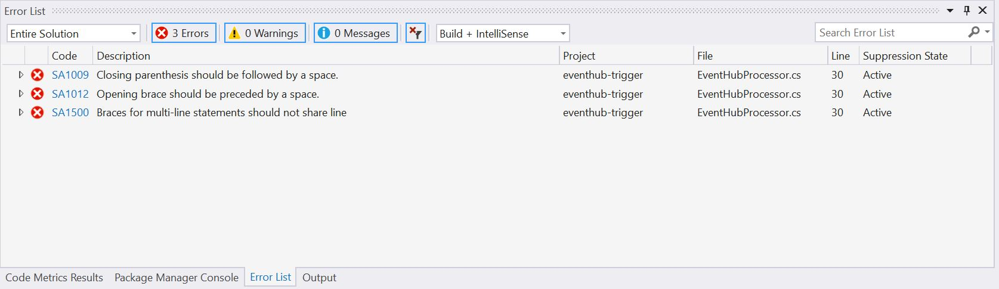
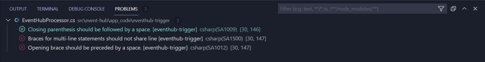
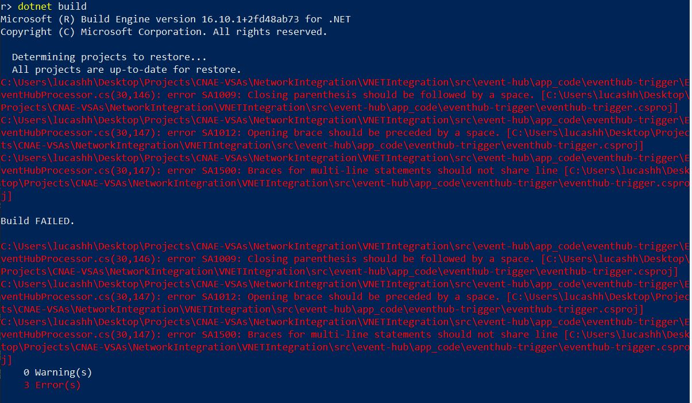

# Code Analysis

All .NET projects in the src folder come equipped with code analysis capabilities provided via Roslyn Analyzers and StyleCop.

## .editorconfig and common.props

The behavior and rules for code analysis are defined and applied to all projects in the src folder through the [.editorconfig](../src/.editorconfig) and [common.props](../src/common.props) files.

The .editorconfig defines different style and formatting conventions with corresponding levels of severity. While each sub project can contain an additional .editorconfig, if necessary, the root .editorconfig linked above applies rules to all sub projects. Behavior for specific rules can be overridden with the syntax in the following example:

```.editorconfig
dotnet_diagnostic.IDE0055.severity = error
dotnet_diagnostic.SA1200.severity = suggestion
```

The .editorconfig settings are applied to all sub-projects through the common.props file. The common.props file defines the packages necessary for running the code analysis rules defined in .editorconfig, specifically `Microsoft.CodeAnalysis.NetAnalyzers` and `StyleCop.Analyzers`. Sub-projects within the src folder import the common.props, which allows them to install and utilize those packages.

## Configuring Projects for Code Analysis

New projects added to the src folder must be configured for code analysis. While most all StyleCop rules are defined in the root .editorconfig file, each sub-project in the src folder must contain a style.cop.json file that contains documentation rules. Use [stylecop.json](../src/common/app_code/eventhub-trigger/stylecop.json) as an example.

Next, the .csproj file requires a few additional lines. Include the stylecop.json file:

```xml
<ItemGroup>
  <AdditionalFiles Include="stylecop.json" />
</ItemGroup>
```

In order to pull in the packages defined by common.props to run the code analysis properly, add the following line:

```xml
<Import Project="<COMMON.PROPS_RELATIVE_PATH>" />
```

Finally, within the `<PropertyGroup>` tag, enable the XML documentation file:

```xml
<GenerateDocumentationFile>true</GenerateDocumentationFile>
```

## Local Code Analysis

### Visual Studio

Code analysis is automatically integrated with Visual Studio and runs in the background. As changes are made, violations will appear in the **Error List** pane.



Alternatively, a build can be triggered via Visual Studio to run the Code Analysis ad-hoc.

### Visual Studio Code

Code analysis does not work in Visual Studio Code by default and must be enabled. Navigate to VS Code settings (File -> Preferences -> Settings), search for "omnisharp" and enable Roslyn Analyzers and Editor Config Support.


As changes are made, violations will appear in the **Problems** pane.



Alternatively, a build can be triggered via Visual Studio Code to run the Code Analysis ad-hoc.

### Command Line

Code Analysis is built into the `build` command and can be run from the command line as well. Navigate to the project directory and run `dotnet build` which outputs the errors and warnings from the analysis.


