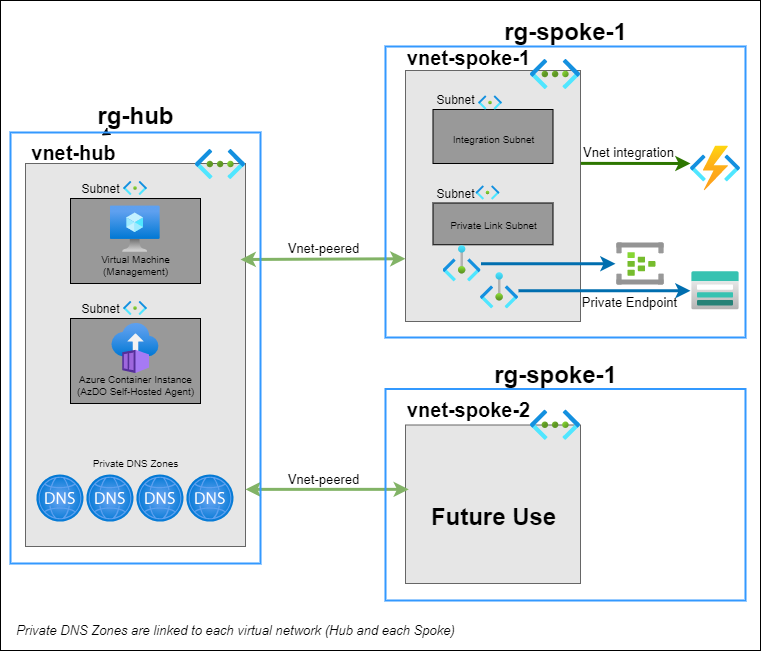

# Recipes

This project contains multiple recipes related to using Azure cloud native applications with a virtual network. The recipes serve as a starting point to achieve a specific objective. Recipes can be enhanced or modified to fit additional tastes.

The recipes do not, in most cases, represent a full, end-to-end scenario. The recipes can be used as a reference or starting point to complete a scenario.

## Recipe Index

The following recipes are currently available:

<!-- Link to the README.md file for each recipe -->

| Recipe Name                                                                                                 | Last Updated Date | Description                                                                                                                             |
| ----------------------------------------------------------------------------------------------------------- | ----------------- | --------------------------------------------------------------------------------------------------------------------------------------- |
| [Azure Functions with Private Event Hub](../src/az-func-event-hub/README.md)                                | 2022-10-08        | Messages sent privately through an Event Hub in a virtual network trigger an Azure Functions based workload                             |
| [Azure Function with Private HTTP Endpoint](../src/az-func-http/README.md)                                  | 2022-10-10        | Access HTTP/S endpoint(s) of an Azure Function exclusively via a private endpoint.                                                      |
| [Azure Web App with Private HTTP Endpoint](../src/az-webapp-http/README.md)                                 | 2022-10-10        | Access HTTP/S endpoint(s) of an Azure Web App exlusively via a private endpoint.                                                        |
| [Azure Application Gateway with internal API Management and Web App](../src/az-webapp-apim-appgw/README.md) | 2022-10-10        | Access the private (internal) HTTPS endpoint of an Azure Web App via Application Gateway and an internal Azure API Management instance. |
| [Azure Databricks in a Virtual Network](..//src/az-databricks/README.md)                                    | 2022-03-25        | Deploy and access an Azure Databricks workspace with VNet injection enabled.                                                            |
| [Azure Data Factory in a Managed Virtual Network](../src/az-datafactory/README.md)                          | 2022-03-25        | Deploy an Azure Data Factory utilizing a Managed VNet for the Integration runtime and access it via private endpoints.                  |
| [Azure Purview in a Virtual Network](../src/az-purview/README.md)                                           | 2022-03-25        | Deploy an Azure Purview instance in a Virtual Network and access it via private endpoints.                                              |
| [Azure Synapse in a Managed Virtual Network](../src/az-synapse/README.md)                                   | 2022-03-25        | Deply and access an Azure Synapse workspace in a managed VNet with public access "disabled" and data exfiltration protection "enabled". |

## Recipe Usage

Each recipe consists of items needed to deploy and use the recipe. Included with each recipe is the following:

- Terraform and Bicep assets to deploy the required Azure resources. Please note that the four "data" recipes (Azure Synapse, Azure Databricks, Azure Data Factory and Azure Purview) only have the "bicep" version available currently.
- Assets to use the recipe within a Visual Studio Code dev container.
- Recipe-specific documentation.
- Scripts to deploy, tests, or otherwise interact with the recipe.
- Application code related to the recipe (e.g., an Azure Web App or Azure Function App)

## Virtual Network Architecture

Many of the recipes follow a hub-spoke virutal network architecture.  The hub virtual network serves as a management/operations virtual network.  Each recipe will be provisioned within a designated spoke virtual network.  Each spoke virtual network should be peered to the hub, allowing for network communication between the hub and spoke.  The breakdown of responsibilities of the virtual networks is as follows:

### Hub Virtual Network

- Contain self-hosted agents for deploying code to, or executing scripts against, resources contained within the spoke virtual network.
- Contain a single Azure VM to serve as a management/jumpbox for interacting with resources connected to the spoke virtual network.  Access to the VM should be managed via Just-in-Time Access.
- Defaults to using the 10.0.0.0/16 address space.

### Spoke Virtual Network

- Rely on self-hosted agent(s) and management/jumpbox Azure VM in the hub virtual network.
- Maintain connection (peering relationship) to the hub for the duration of the deployed recipe.
- Created within a recipe-specific resource group.
- Use a 10.X.0.0/16 address space (where X is an incrementing digit starting with 1).

### Common

- The hub and spoke virtual network should be in the same Azure region.
- Virtual network address spaces must not overlap.

### Architecture

The diagram below represents a high-level overview architecture of the hub-spoke virtual network approach.

## Considerations

- There is not a recipe for every Azure service, or combination of services.
- Bicep and Terraform modules may be shared between several recipes. If you need a single recipe, you may need to copy modules used by the recipe from the shared location (`\src\common\infrastructure\terraform\modules\network` folder) to the appropriate `deploy` folder in the recipe (e.g., `\src\recipeA\deploy\terraform`). The relative path to the referenced module(s) may also need to be updated.
