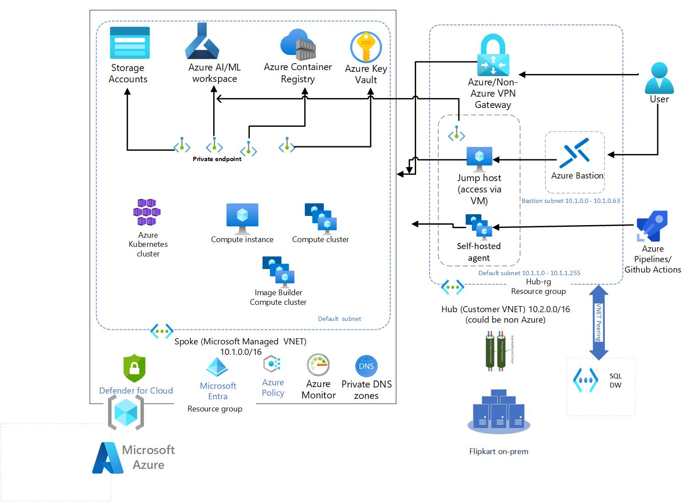

# Azure Machine Learning in a managed virtual network

<!-- Replace "Recipe Template" title with name of the recipe. -->

## Scenario

<!-- Describe the usage scenario for this template.  Describe the challenges this recipes aims to address. -->
This scenario aims to address the challenge of correctly configuring an Azure machine learning workspace within a Microsoft managed VNet including ensuring appropriate connectivity with common services such as Storage and Key Vault.

### Problem Summary

<!--Briefly describe the problme that this recipe intends to resolve or make easier. -->
Azure machine learning workspace is composed of a number of different components: workspace storage account, key vault, machine learning Data Pipelines and Data Flows, SQL Dedicated pools, SQL Serverless pools, Spark pools and other external data sources. Despite being under a single machine learning umbrella service, each of these sub-components require a slightly different VNet configuration treatment to properly isolate network traffic. For example, generally you need at least four Private Endpoints configured for a single workspace each with connecting to a different sub-component. Another example, while managed workspace are generally a single tenant service with compute resources spun up within a designated Managed VNet, data scientist vm's, azure dev ops pipelines could be multi-tenanted and therefore require provisioning a Private Endpoint within the hub vnet in order to connect to the workspace successfully.

In addition to this, customers will also need to ensure that traffic between the Azure machine learning workspace studio can still privately flow between the workspace components and additional Azure services such as Storage and Key Vault. This is done through the use of Private Endpoints.

This recipe aims to provide developers a starting point with IaC + PaC example of an Azure machine learning workspace with all sub-component correctly configured to ensure traffic stays private, while still being able to connect to common additional services such as machine learning studio Azure Storage and Azure Key Vault.

### Architecture

<!-- Include a high-level architecture diagram of the components used in this recipe. -->

### Recommendations

The following sections provide recommendations on when this recipe should, and should not, be used.

#### Recommended

<!-- Provide details on when usage of this recipe is recommended. -->
This recipe is recommended if the following conditions are true:

- TODO

#### Not Recommended

<!-- Provide details on when usage of this recipe is NOT recommended. -->
This recipe is **not** recommended if the following conditions are true:

- TODO

## Getting Started

<!-- Provide instructions on how a user would use this recipe (e.g., how they would deploy the resources). -->

### Pre-requisites

<!-- List the pre-reqs for use of this recipe (SDKs, roles/permissions, etc.) -->
The following pre-requisites should be in place in order to successfully use this recipe:

- TODO

### Deployment

To deploy this recipe, please perform the following actions:

<!-- Provide instructions on how to deploy the recipe. -->

## Change Log

<!--
Describe the change history for this recipe. For example:
- 2021-06-01
  - Fix for bug in Terraform template that prevented Key Vault reference resolution for function app.
-->

## Next Steps

<!-- Provide description and links to what a user of this recipe could do next.  Include suggestions for how the recipe could be enhanced or built upon. -->
