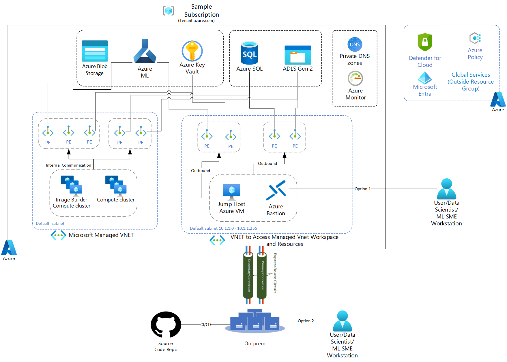

# Azure Machine Learning Workspace in a managed virtual network (Allow Internet Outbound)

<!-- Replace "Recipe Template" title with name of the recipe. -->

## Scenario

<!-- Describe the usage scenario for this template.  Describe the challenges this recipes aims to address. -->
This scenario aims to address the challenge of correctly configuring an Azure machine learning workspace within a Microsoft managed VNet including ensuring appropriate connectivity with common services such as Azure Storage Account, Azure Key Vault, Azure Container Registry.

⚠️ WARNING: This code is experimental at this stage and provided solely for evaluation purposes. It is NOT intended for production use and may contain bugs, incomplete features, or other issues. Use at your own risk, as it may undergo significant changes without notice, and no guarantees or support are provided. By using this code, you acknowledge and agree to these conditions. Consult the documentation or contact the maintainer if you have questions or concerns.

### Problem Summary

<!--Briefly describe the problme that this recipe intends to resolve or make easier. -->
Azure machine learning workspace is composed of a number of different components: Machine Learning Studio, workspace storage account, key vault, machine learning Data Pipelines, container registry and other external data sources like Azure SQL Server, ADLS Gen2. Despite being under a single machine learning umbrella service, each of these sub-components require a slightly different VNet configuration treatment to properly isolate network traffic. For example, generally you need at least four Private Endpoints configured for a single workspace each with connecting to a different sub-component. Another example, while managed workspace are generally a single tenant service with compute resources spun up within a designated Managed VNet, data scientist vm's, azure dev ops pipelines could be multi-tenanted and therefore require provisioning a Private Endpoint within the bridge vnet in order to connect to the workspace successfully. 

In addition to this, customers will also need to ensure that traffic between the Azure machine learning workspace studio can still privately flow between the workspace components and additional Azure services such as storage external to the managed VNet. This is done through the use of Private Endpoints. Another important that one has to keep in mind is the secure integration of Azure Machine Learning with Azure DevOps pipelines and Github actions that are enabled through the bridge virtual network (VNet to access resources in the architecure diagram).

This recipe aims to provide developers a starting point with an IaC example of an Azure machine learning managed-vnet workspace with all sub-components correctly configured to ensure traffic stays private, while still being able to connect to common additional services such as Azure Storage Account, ADLS Gen2 and Azure Key Vault.

### Architecture

<!-- Include a high-level architecture diagram of the components used in this recipe. -->



### Recommendations

The following sections provide recommendations on when this recipe should, and should not, be used.

#### Recommended

<!-- Provide details on when usage of this recipe is recommended. -->
This recipe is recommended if the following conditions are true:

- You want to isolate traffic at the network layer for your machine learning workspace and its sub-components.
- You can't have public IPs for your Azure machine learning workspace and its sub-components.

#### Not Recommended

<!-- Provide details on when usage of this recipe is NOT recommended. -->
This recipe is **not** recommended if the following conditions are true:

- Azure Machine Learning workspace is required to be accessible from the public Internet
- Customer wants to use their own BYO virtual network for the ML workspace 

## Getting Started

<!-- Provide instructions on how a user would use this recipe (e.g., how they would deploy the resources). -->

### Pre-requisites

<!-- List the pre-reqs for use of this recipe (SDKs, roles/permissions, etc.) -->
The following pre-requisites should be in place in order to successfully use this recipe:

- [Azure CLI](https://docs.microsoft.com/cli/azure/install-azure-cli)
- [.NET Core 7.0](https://docs.microsoft.com/dotnet/core/install/)
- [Terraform](https://www.terraform.io/downloads.html) (Only if using Terraform)
- [Terraform on Azure](https://learn.microsoft.com/en-us/azure/developer/terraform/overview)
- [Configure Terraform in Windows on Bash](https://learn.microsoft.com/en-us/azure/developer/terraform/get-started-windows-bash?tabs=bash)
- [Azure PowerShell](https://docs.microsoft.com/powershell/azure/install-az-ps) (Only if using Azure PowerShell to deploy via Azure Bicep)

### Deployment

To deploy this recipe, perform the infrastructure deployment steps using Terraform. Unix/Linux shell script is also provided with az cli commands to peform the quick set-up in PoC enviroments.

<!-- Provide instructions on how to deploy the recipe. -->

#### Deploying Infrastructure Using Terraform

<!-- TODO: Update to use Azure CLI. -->

[Pre-requisites](https://learn.microsoft.com/en-us/azure/developer/terraform/get-started-windows-bash?tabs=bash)
- Azure subscription: If you don't have an Azure subscription, create a free account before you begin.
- There are many options on Windows to run bash commands, including Git Bash and Windows Terminal. This article has been tested using Git Bash. Download   and install [Git Bash](https://git-scm.com/download/win).
- [Install the Azure CLI](https://learn.microsoft.com/en-us/cli/azure/install-azure-cli-windows)
- Install Terraform for Windows
  - [Download Terraform](https://www.terraform.io/downloads.html)
  - From the download, extract the executable to a directory of your choosing (for example, c:\terraform). 
  - Update your [system's global path to the executable](https://stackoverflow.com/questions/1618280/where-can-i-set-path-to-make-exe-on-windows).
  - Open a terminal window. Verify the global path configuration with the terraform command.
    ### Bash
    ```
     terraform version
     ```
### Bash
```
az login --use-device-code
az account set --subscription SUBSCRIPTION_ID
```

### Bash
   ```Bash
   az group create --location <LOCATION> --name <RESOURCE_GROUP_NAME>
   ```
### Bash
 ```Bash
   mkdir src
 ```
### Bash
 ```Bash
   cd src
   mkdir aml_managed_vnet
   cd aml_managed_vnet
   cp *.tf .
 ```
Note: For this step, the terraform scripts supplied by us has to be copied to the bash terminal at the user defined location. Subsequently, those scripts are required to be copied to the /src/aml_managed_vnet location in the same bash terminal.

### Bash
 ```Bash
   pwd
   cd /src/aml_managed_vnet
   terraform init
   terraform plan -out mvnetworkspace.tfplan
   terraform apply mvnetworkspace.tfplan
 ```
### Setting up VNet to access the Managed VNet Workspace and its resources 
In order to connect to an AML workspace secured via a Managed VNet, you should create a private endpoint for the AML workspace inside a VNet where you would like to have access to the workspace (for example, inside a hub VNet). Simply follow the steps for [adding a private endpoint to a workspace](https://learn.microsoft.com/en-us/azure/machine-learning/how-to-configure-private-link?view=azureml-api-2&tabs=cli#add-a-private-endpoint-to-a-workspace) in Azure CLI or Portal.

Once the private endpoint is created, there are several ways that you can connect to the secured workspace. The steps in the following article use a jump box for [connecting to the workspace](https://learn.microsoft.com/en-us/azure/machine-learning/tutorial-create-secure-workspace-vnet?view=azureml-api-2#connect-to-the-workspace), which is a virtual machine in the same VNet as where you have created the private endpoint. Alternatively, you can use Azure VPN gateway for connecing on-premises networks to the VNet where the private endpoint is created, or use ExpressRoute to connect on-premises networks into the cloud over a private connection.

In addition to adding a private endpoint for the AML workspace, a private endpoint should be created for the AML dependant resources such as Azure Blob Storage and Key Vault inside your chosen VNet to enable connectivity to these resources.

### Testing Solution

    - To verify the solution is working as intended, the data scientist 

## Change Log

<!--
Describe the change history for this recipe. For example:
- 2021-06-01
  - Fix for bug in Terraform template that prevented Key Vault reference resolution for function app.
-->
- 2024-01-11 - Created feature branch and check-in code in i 
- 

## Next Steps

<!-- Provide description and links to what a user of this recipe could do next.  Include suggestions for how the recipe could be enhanced or built upon. -->
