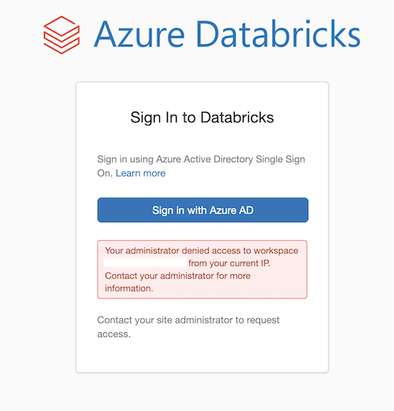

# VNet injection of Azure Databricks workspace

<!-- Replace "Recipe Template" title with name of the recipe. -->

## Scenario

<!-- Describe the usage scenario for this template.  Describe the challenges this recipe aims to address. -->
This scenario aims to address the challenge of correctly configuring an Azure Databricks within a VNet including ensuring appropriate connectivity with common services such as Storage and Key Vault.

### Problem Summary

<!--Briefly describe the problem that this recipe intends to resolve or make easier. -->
Azure Databricks supports deployment of data plane resources into a customer provided VNet in a process called [VNet injection](https://docs.microsoft.com/azure/databricks/administration-guide/cloud-configurations/azure/vnet-inject). Isolating Azure Databricks networking differs to other data services (particularly ones which utilizes primarily Private Endpoints and/or support Managed VNets to isolate traffic) because of the need for the management of the Data Plane VNet by the user and explicit handling of the required network traffic to the shared, multi-tenanted Azure Databricks Control Plane.

This recipe aims to provide developers a starting point with IaC (Infrastructure as code) example of deploying Azure Databricks into a VNet while still being able to connect to common additional services such as Storage and Key Vault. Note that an enterprise-grade Azure Databricks deployment will typically involve routing control plane traffic through a central firewall or similar network appliance. See this article on [Data Exfiltration Protection with Azure Databricks](https://databricks.com/blog/2020/03/27/data-exfiltration-protection-with-azure-databricks.html) and a [corresponding sample](https://github.com/Azure-Samples/modern-data-warehouse-dataops/tree/main/single_tech_samples/databricks/sample2_enterprise_azure_databricks_environment).

### Architecture

<!-- Include a high-level architecture diagram of the components used in this recipe. -->


### Recommendations

The following sections provide recommendations on when this recipe should, and should not, be used.

#### Recommended

<!-- Provide details on when usage of this recipe is recommended. -->
This recipe is recommended if the following conditions are true:

- You want a starting point to deploy an Azure Databricks workspace with VNet injection enabled.

#### Not Recommended

<!-- Provide details on when usage of this recipe is NOT recommended. -->
This recipe is **not** recommended if the following conditions are true:

- A fully configurable, enterprise-grade Azure Databricks deployment with data exfiltration prevention. This recipe gets you part way there but doesn't configure everything to enable this use case.

## Getting Started

<!-- Provide instructions on how a user would use this recipe (e.g., how they would deploy the resources). -->

### Pre-requisites

The following pre-requisites should be in place in order to successfully use this recipe:

- [Azure CLI](https://docs.microsoft.com/cli/azure/install-azure-cli)
- [Azure CLI extension: Databricks](https://docs.microsoft.com/cli/azure/databricks?view=azure-cli-latest)
- [Databricks CLI](https://docs.databricks.com/dev-tools/cli/index.html#install-the-cli)
- [jq](https://formulae.brew.sh/formula/jq)
- [Bicep](https://docs.microsoft.com/azure/azure-resource-manager/bicep/install) (Only if using Azure Bicep)
- [Azure PowerShell](https://docs.microsoft.com/powershell/azure/install-az-ps) (Only if using Azure PowerShell to deploy via Azure Bicep)

### Deployment

To deploy this recipe, please perform the following actions:

#### Deploying Infrastructure Using Bicep

- Open the command prompt and change directory to the `bicep` folder.

```bash
cd <WORKSPACE_LOCATION>/src/az-databricks/deploy/bicep
```

- Login to Azure CLI and set the subscription you want to use.

```bash
az login

az account set -s <subscription_id>
```

- Create a new Azure resource group to deploy the Bicep template, passing in a location and name.

```bash
az group create --location <LOCATION> --name <RESOURCE_GROUP_NAME>
```

- The [main.bicep](./deploy/bicep/main.bicep), which is the main file for the Bicep deployment, already has the default values for the required parameters. If you prefer to override these default values, you can rename the [azuredeploy.parameters.sample.json](./deploy/bicep/azuredeploy.parameters.sample.json) file to **azuredeploy.parameters.json** and modify the required parameters.

- Optionally, verify what Bicep will deploy, passing in the name of the resource group created earlier and the necessary parameters for the Bicep template.

```bash
az deployment group what-if --resource-group <RESOURCE_GROUP_NAME> --template-file main.bicep --parameters azuredeploy.parameters.json --verbose
```

- Deploy the template, passing in the name of the resource group created earlier and the necessary parameters for the Bicep template.

```bash
az deployment group create --resource-group <RESOURCE_GROUP_NAME> --template-file main.bicep --parameters azuredeploy.parameters.json --verbose
```

- Create an Azure Key Vault-backed secret scope and save the Azure Storage account Key as a secret in Azure Key Vault.

This is done by executing the shell script `/src/az-databricks/scripts/manage-databricks-secret-scope.sh`. This script requires four parameters which are the various resource names created in the previous step of Bicep deployment and performs the following actions:

1. Retrieves the key for the Storage account.
1. Store it in Azure Key Vault as secret named `StorageAccountKey`.
1. Use Databricks REST API to create Azure Key Vault-based secret scope named `storage-scope`.

The 2nd step, which is to store the secret in Azure Key Vault, can't be done from a public network as the public access is disabled. That's why the script needs to be executed from a Virtual Machine (VM) in a VNet which has access to Azure Key Vault using private endpoints. For simplicity, you can deploy this VM in the same application VNet which has been created as part of Bicep deployment as it has the required networking setup. Please follow the [Azure Documentation](https://docs.microsoft.com/azure/virtual-machines/linux/quick-create-portal) for detailed instructions.

```bash
cd <WORKSPACE_LOCATION>/src/az-databricks/deploy/scripts

chmod +x manage-databricks-secret-scope.sh

./manage-databricks-secret-scope.sh <RESOURCE_GROUP_NAME> <DATABRICKS_WORKSPACE_NAME> <STORAGE_ACCOUNT_NAME> <KEYVAULT_NAME>
```

Alternatively, you can use Azure Portal to perform these actions. But you still need to access the Azure Portal from a VM which has connectivity to Azure Key Vault via private endpoints otherwise you won't be able to set and retrieve secrets in Azure Key Vault.

1. Retrieve the Azure Storage account key. ([Reference](https://docs.microsoft.com/azure/storage/common/storage-account-keys-manage?tabs=azure-portal#view-account-access-keys))
1. Store the account key as secret in Azure Key Vault. ([Reference1](https://docs.microsoft.com/azure/databricks/security/secrets/secrets#create-a-secret) and [Reference2](https://docs.microsoft.com/azure/key-vault/secrets/quick-create-portal#add-a-secret-to-key-vault))
1. Create an Azure Key Vault-backed secret scope. ([Reference](https://docs.microsoft.com/azure/databricks/security/secrets/secret-scopes#--create-an-azure-key-vault-backed-secret-scope))

### Test the Recipe

We will start by verifying that the Databricks secret scope has been successfully created and that the storage account key is stored in Azure Key Vault as a secret. For this, we will be using [Databricks CLI](https://docs.databricks.com/dev-tools/cli/index.html) and use Databricks `personal access token` (PAT) for authentication. Please refer to [Databricks Documentation](https://docs.databricks.com/dev-tools/api/latest/authentication.html#generate-a-personal-access-token) on how to generate a personal access token.

```bash
# Configuring Databricks CLI using Personal Access Token (PAT)
$ databricks configure --token
Databricks Host (should begin with https://): https://adb-3762147546010750.10.azuredatabricks.net
Token: 
```


Once we have the databricks CLI configured, we can validate the details:

```bash
# List databricks secret scopes
$ databricks secrets list-scopes
Scope          Backend         KeyVault URL
-------------  --------------  -----------------------------------------
storage-scope  AZURE_KEYVAULT  https://kv-vrefntrigl2a2.vault.azure.net/

# List databricks secrets under the secret scope
$ databricks secrets list --scope storage-scope
Key name             Last updated
-----------------  --------------
StorageAccountKey   1645583416000

# Check secret value in Azure Key Vault
$ az keyvault secret show --name StorageAccountKey --vault-name kv-vrefntrigl2a2 --query "value" --output tsv
yPIf/A....
```

Here, we validated that the secret scope has been created successfully and is using Azure Key Vault as the backend. We also checked that there is a secret named `StorageAccountKey` and retrieved its value using Azure CLI command.

The next step is to login to Azure Databricks workspace and create a cluster so that we can run the notebook. Please refer to [Azure Documentation](https://docs.microsoft.com/azure/databricks/clusters/create#use-the-create-button) on how to create a cluster. Once the cluster is up and running, we can create a Python notebook and attach it to the cluster that we just created. For detailed instruction on how to create a Databricks notebook, please follow the [Azure Documentation](https://docs.microsoft.com/azure/databricks/notebooks/notebooks-manage#create-a-notebook).

Now copy the below code snippet to the notebook, update the `<storage_account_name>` and `<storage-container-name>` variables, and execute it. The code gets the storage account key using the secret scope and use that to write/read files to/from Blob Storage.

```python
from pyspark.sql.functions import to_date

# Please update <storage_account_name> and <container_name> with actual values
storage_account_name = "<storage-account-name>"
container_name = "<storage-container-name>"
mount_name = "raw"
scope_name = "storage-scope"
key_name = "StorageAccountKey"

# Mounting the filesystem, skip if already mounted
mounts = [str(i) for i in dbutils.fs.ls('/mnt/')]
if "FileInfo(path='dbfs:/mnt/" + mount_name + "/', name='" + mount_name + "/', size=0)" in mounts:
    print("'%s' has already been mounted." % (mount_name))
else:
# As we are using Azure Key Vault-backed secret scope, the Storage Account key is retreived from the Azure Key Vault in "extra_configs" attribute.
    dbutils.fs.mount(
      source = format("wasbs://%s@%s.blob.core.windows.net", container_name, storage_account_name),
      mount_point = format("/mnt/%s", mount_name),
      extra_configs = {format("fs.azure.account.key.%s.blob.core.windows.net", storage_account_name):dbutils.secrets.get(scope = scope_name, key = key_name)})

# Creating a dummy data frame
df = spark.createDataFrame(
    [
        ('AAPL', '2021-02-07 00:00:00', 172.86, 173.95, 170.95, 171.66), 
        ('AAPL', '2021-02-08 00:00:00', 171.73, 175.35, 171.43, 174.83),
        ('AAPL', '2021-02-09 00:00:00', 176.05, 176.65, 174.90, 176.28),
        ('AAPL', '2021-02-10 00:00:00', 174.14, 175.48, 171.55, 172.12),
        ('MSFT', '2021-02-07 00:00:00', 306.17, 307.84, 299.90, 300.95),
        ('MSFT', '2021-02-08 00:00:00', 301.25, 305.56, 299.95, 304.56),
        ('MSFT', '2021-02-09 00:00:00', 309.87, 311.93, 307.39, 311.21),
        ('MSFT', '2021-02-10 00:00:00', 304.04, 309.12, 300.70, 302.38),
        ('DIS',  '2021-02-07 00:00:00', 143.39, 144.09, 141.61, 142.51),
        ('DIS',  '2021-02-08 00:00:00', 141.79, 142.88, 140.74, 142.48),
        ('DIS',  '2021-02-09 00:00:00', 144.37, 147.36, 143.25, 147.23),
        ('DIS',  '2021-02-10 00:00:00', 156.02, 157.50, 151.11, 152.16)
    ], 
    [ 'Ticker', 'Date', 'Open', 'High', 'Low', 'Close' ])

# Defining "Date" as date column
df = df.withColumn('Date', to_date('Date'))
# Writing the dataframe to the file system as parquet
df.write.mode('overwrite').parquet("/mnt/raw/")

# Now, reading those parquet files in a different dataframe and displaying the content
data = spark.read.parquet("/mnt/raw")
display(data)
```

There are few points worth mentioning here as follows:

- In case of Azure Databricks, the workspace access is still possible from public network, even if it's deployed in a secured VNet configuration. This behaviour is different from Azure Synapse which can restrict public workspace access altogether.

- A simple way of controlling workspace (aka web application) access is by defining an [IP access list](https://docs.microsoft.com/azure/databricks/security/network/ip-access-list). Azure Databricks customers can use the IP access lists feature to define a set of approved IP addresses. All incoming access to the web application and REST APIs requires the user connect from an authorized IP address. Here is an illustration of how this feature works.

```bash
# Geting the Databricks token for authentication
# 2ff814a6-3304-4ab8-85cb-cd0e6f879c1d is a constant, unique applicationId that identifies Azure Databricks workspace resource inside Azure
$ adbGlobalToken=$(az account get-access-token --resource 2ff814a6-3304-4ab8-85cb-cd0e6f879c1d --output json | jq -r .accessToken)
# Building the header
$ authHeader="Authorization: Bearer ${adbGlobalToken}"
# The Databricks Instance (URL)
$ databricksInstance="https://adb-3762147546010750.10.azuredatabricks.net"

# Passing the bearer token to check if the IP Access List feature is enabled on this Databricks instance or not
$ curl -X GET --header "${authHeader}" ${databricksInstance}/api/2.0/workspace-conf?keys=enableIpAccessLists
{"enableIpAccessLists":null}

# Enabling the IP Access List feature
$ curl -X PATCH --header "${authHeader}" -n ${databricksInstance}/api/2.0/workspace-conf -d '{"enableIpAccessLists": "true"}'

# Confirming that it has been enabled
$ curl -X GET --header "${authHeader}" ${databricksInstance}/api/2.0/workspace-conf?keys=enableIpAccessLists
{"enableIpAccessLists":"true"}

# Blocking a particular IP address from accessing the Databricks web application and REST APIs.
$ curl -X POST --header "${authHeader}" -n \
>   ${databricksInstance}/api/2.0/ip-access-lists -d '{
>     "label": "public-ip",
>     "list_type": "BLOCK",
>     "ip_addresses": [
>         "101.116.8.251"
>         ]
>     }'
{"ip_access_list":{"list_id":"8bd51182-295d-4296-a7a8-1569577c236b","label":"public-ip","ip_addresses":["101.116.8.251"],"address_count":1,"list_type":"BLOCK","created_at":1645612694717,"created_by":3721875752137362,"updated_at":1645612694717,"updated_by":3721875752137362,"enabled":true}}
```

Please note that the last command to block the IP address is executed from a different machine that then one whose IP address is being blocked. You will get the following error message if you try so:

```bash
$ curl -X POST --header "${authHeader}" -n \
>   ${databricksInstance}/api/2.0/ip-access-lists -d '{
>     "label": "public-ip",
>     "list_type": "BLOCK",
>     "ip_addresses": [
>         "101.116.8.251"
>         ]
>     }'
{"error_code":"INVALID_STATE","message":"Your current IP 101.116.8.251 will not be allowed to access the workspace under current configuration"}
```

Once blocked, the IP address 101.116.8.251 can no longer access the web application and REST APIs. The following error is thrown while executing the REST APIs from the blocked machine:

```bash
$ curl -X POST --header "${authHeader}" -n   ${databricksInstance}/api/2.0/ip-access-lists     
{"error_code":"403","message":"Unauthorized access to Org: 3762147546010750"}
```

Similarly, if you try to access the Databricks workspace, you get the following error message:



Congratulations, you have successfully deployed and tested Azure Databricks in a secured VNet configuration!

## Specific Observations and their Explainations

### The Azure CLI command to generate Datbricks access token fails on Ubuntu

If you are deploying this recipe from VM running on Ubuntu (and few other version of linux), the Azure CLI command to generate the Databricks access token might fail:

```bash
# Checking OS Version
$ lsb_release -d
Description: Ubuntu 20.04.3 LTS

# CLI command to generate databricks access token
$ az account get-access-token --resource 2ff814a6-3304-4ab8-85cb-cd0e6f879c1d --output json
AADSTS50005: User tried to log in to a device from a platform (Unknown) that is currently not supported through Conditional Access policy. Supported device platforms are: iOS, Android, Mac, and Windows flavors.
Trace ID: dee41a2d-cb61-438b-8489-eead3ab42e00
...
```

As this command is used in [manage-databricks-secret-scope.sh](../az-databricks/deploy/scripts/manage-databricks-secret-scope.sh) script, the step for creation of Azure Key Vault-backed secret scope would fail.

As a workaround of this issue, the following options can be explored:

- Generate the token on Windows/Mac and pass that token by manually modifying the script.
- Use Azure Portal to create the secret scope. ([Reference](https://docs.microsoft.com/azure/databricks/security/secrets/secret-scopes#--create-an-azure-key-vault-backed-secret-scope))
- Deploy the script from Windows/Mac. Please note that it works for [WSL](https://docs.microsoft.com/windows/wsl/install) on Windows which also runs "Ubuntu" as the default Linux distribution.

### The [manage-databricks-secret-scope.sh](../az-databricks/deploy/scripts/manage-databricks-secret-scope.sh) script creates secret scope only for the login type `user`

Currently, there is a limitation that Azure Key Vault-backed secret scope can't be created while logged in as a Service Principal (e.g.: AzDo CI/CD Pipelines). The following error message is thrown:

```bash
{"error_code":"CUSTOMER_UNAUTHORIZED","message":"Unable to grant read/list permission to Databricks service principal to KeyVault 'https://<keyvault-name>.vault.azure.net/': key not found: https://graph.windows.net/"}
```

To avoid this, the secret scope is created only if logged in as `User`. In case of `Service Pricipal` login, this step is skipped in the script and has to be performed manually.

## Change Log

<!--
Describe the change history for this recipe. For example:
- 2021-06-01
  - Fix for bug in Terraform template that prevented Key Vault reference resolution for function app.
-->

## Next Steps

Note that the Azure Databricks deployment can be further hardened from a network security perspective in order to prevent data exfilteration. See this article on [Data Exfiltration Protection with Azure Databricks](https://databricks.com/blog/2020/03/27/data-exfiltration-protection-with-azure-databricks.html) and a [corresponding sample](https://github.com/Azure-Samples/modern-data-warehouse-dataops/tree/main/single_tech_samples/databricks/sample2_enterprise_azure_databricks_environment) for more information and implementation details.
