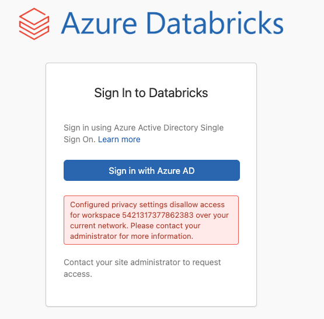

# Azure Databricks Deployment in Secured Networking Environment

## Scenario

This scenario aims to provide a sample architecture to deploy Azure Databricks in a secured networking environment using various available configuration options.

## Problem Summary

Azure Databricks provides a secure networking environment by default, but it also provides several additional features to further harden the network security. Here is a list of some of these features which the recipe uses.

- [VNet Injection](https://learn.microsoft.com/azure/databricks/administration-guide/cloud-configurations/azure/vnet-inject)
- [Secure Cluster Connectivity](https://learn.microsoft.com/azure/databricks/security/network/secure-cluster-connectivity)
- [IP Access List](https://learn.microsoft.com/azure/databricks/security/network/ip-access-list-workspace)
- [Azure Private Link](https://learn.microsoft.com/azure/databricks/administration-guide/cloud-configurations/azure/private-link)

This recipe aims to provide developers a starting point with IaC(Infrastructure as Code) example of deploying Azure Databricks into a VNet and [enabling Azure Private Link as a standard deployment](https://learn.microsoft.com/azure/databricks/administration-guide/cloud-configurations/azure/private-link-standard). Please note that this is just one of the many possible configurations in which such an environment can be deployed based on your requirements.

## Architecture


There are a lot of peculiarities in the above architecture which are described below.

### Private DNS Zone "privatelink.azuredatabricks.net"

Previously, Azure Databricks lacked a mechanism for facilitating private links for front-end and back-end traffic. Instead, users were obliged to rely on IP access lists for regulating front-end access and User Defined Routes (UDR) for transmitting back-end traffic from the data plane to the Azure Databricks control plane. However, Azure Databricks has recently implemented a new Private DNS Zone, designated as "privatelink.azuredatabricks.net", to enable private links for both front-end and back-end traffic.

### Private Endpoints

#### Front-end Private Endpoint (aka user to workspace)

The implementation of a front-end private endpoint enables users to establish a secure connection to the Azure Databricks web application, REST API, and Databricks Connect API over a VNet interface endpoint. Notably, the front-end connection is also leveraged by JDBC/ODBC and PowerBI integrations. This capability is facilitated by a novel sub-resource type, designated as "databricks-ui-api".

#### Back-end Private Endpoint (aka data plane to control plane)

Databricks Runtime clusters, situated within a customer-managed VNet, are capable of connecting to the core services of an Azure Databricks workspace located within an Azure Databricks cloud account (the control plane). This functionality facilitates private connectivity between the clusters and the secure cluster connectivity relay endpoint, as well as the REST API endpoint.

The "databricks-ui-api" sub-resource type, employed by the front-end private endpoint, is also utilized in the context of data plane connectivity.

By virtue of the recipe's inclusion of both front-end and back-end private endpoints, it is feasible to enforce private connectivity for the workspace. This entails Azure Databricks' rejection of any attempted connections originating from the public network.

#### Web Authentication Private Endpoint

To support private front-end connections, special configuration is required to support the single sign-on (SSO) login callbacks to the Azure Databricks web application, also known as web authentication. A special type of private connection with sub-resource type "browser_authentication" hosts a private connection from the transit VNet that allows Azure Active Directory to redirect users after login to the correct control plane instance.

One of these connections is shared for all workspaces in the region that share the same private DNS zone. The recommendation from Databricks is to create one web-auth workspace for each region to host the web-auth private network settings. Please note that this workspace doesn't need a connection from the data plane to the control plane. So, it can be configured to for no user login.

Please read through [Private Endpoint to support SSO](https://learn.microsoft.com/azure/databricks/administration-guide/cloud-configurations/azure/private-link-standard#web-authentication) for details.

#### Azure Storage Private Endpoints

The recipe create three different private endpoints for same ADLS Gen2 storage account. Two of these are from Transit VNet with sub-resource "blob" and "dfs". These endpoint allows users to securely access the storage account from the VM to upload/download data.

The third private endpoint is from Databricks workspace VNet with sub-resource "dfs". This endpoint is exclusively used by Databricks to securely access the storage account from the notebooks.

#### Azure Key Vault

This private endpoint is created from the transit VNet with sub-resource "vault". It allows the users to securely access the Key Vault and create or retrieve the secrets.

Due to a particular behaviour of Azure Databricks when using a Key-vault based secret scope in Azure Databricks, the private endpoint from Databricks workspace VNet doesn't work and thus it's not created. Rather, it relies on the option of allowing "Trusted Azure Services" option for accessing Azure Key Vault. Please check [this section](#azure-keyVault-has-allowed-trusted-azure-services) for details.

### Virtual Networks (VNet)

Depending on the deployment choices, the recipe would deploy either two or three virtual networks as described below.

#### Databricks Workspace VNet

It is the VNet in which the Databricks workspace is deployed. This configuration where you deploy Azure Databricks data plane resources in your own virtual network is called as [VNet injection](https://learn.microsoft.com/azure/databricks/administration-guide/cloud-configurations/azure/vnet-inject).

#### Transit VNet

This VNet is created to allow the front-end connectivity to Azure Databricks workspace. It also allows the users to access the storage account and key vault using private endpoints. Please note that the recipe DOESN'T deploy the Virtual Machine (VM), it's shown in the architecture diagram for clarity.

It's also worth noting that the transit VNet and databricks workspace VNet are not peered. That means the frond-end and back-end traffic are completely separated and the databricks workspace has no connectivity in and out of the workspace VNet (except through the private endpoints).

#### Web Authentication Workspace VNet

This VNet is optionally created, if you choose to deploy a separate Web Authentication workspace (`webAuthWorkspacePreference` = `createNew`). 

Please note that this VNet uses a hard-coded IP address range of '10.179.0.0/16' and subnet ranges accordingly. Modify the following parameters to override these default values:

```txt
webAuthWorkspaceVnetAddressPrefix = '10.179.0.0/16'
webAuthWorkspaceContainerSubnetAddressPrefix = '10.179.0.0/24'
webAuthWorkspaceHostSubnetAddressPrefix string = '10.179.1.0/24'
```

### Azure Databricks Workspaces

### Production (Main) Workspace

This is the main workspace which needs to be protected and accessed securely. This workspace is deployed in a user-defined VNet (VNet injection), has workspace public access disabled, has secured cluster connectivity between data plane and control plane (via private links) and Data Exfiltration protection (outbound traffic is disabled via Security Group outbound rule).

To use this workspace as the web-authentication workspace as well, please set the value of parameter `webAuthWorkspacePreference` to `useNew`.

### Web Auth Workspace

As mentioned [here](#web-authentication-private-endpoint), there is generally a single Azure Databricks workspace per region to support web authentication. If you already has such a workspace in your region, please set the value of parameter `webAuthWorkspacePreference` to `useExisting` and pass the resource id of the existing web-auth workspace via parameter `existingWebAuthWorkspaceId`.

For a non-production deployment, you can also choose to use the main Databricks workspace to act as the web authentication workspace as well. For that, please set the value of parameter `webAuthWorkspacePreference` to `useNew`. With this, there would be only one 

## Recommendations

The following sections provide recommendations on when this recipe should, and should not, be used.

### Recommended

This recipe is recommended if the following conditions are true:

- You want a starting point to deploy an Azure Databricks workspace with VNet injection enabled.

### Not Recommended

This recipe is **not** recommended if the following conditions are true:

- A fully configurable, enterprise-grade Azure Databricks deployment with data exfiltration prevention. This recipe gets you part way there but doesn't configure everything to enable this use case.

## Getting Started

### Pre-requisites

The following pre-requisites should be in place in order to successfully use this recipe:

- [Azure CLI](https://docs.microsoft.com/cli/azure/install-azure-cli)
- [Azure CLI extension: Databricks](https://docs.microsoft.com/cli/azure/databricks?view=azure-cli-latest)
- [Databricks CLI](https://docs.databricks.com/dev-tools/cli/index.html#install-the-cli)
- [jq](https://formulae.brew.sh/formula/jq)
- [Bicep](https://docs.microsoft.com/azure/azure-resource-manager/bicep/install) (Only if using Azure Bicep)
- [Azure PowerShell](https://docs.microsoft.com/powershell/azure/install-az-ps) (Only if using Azure PowerShell to deploy via Azure Bicep)

### Deployment

### Deployment Options

There are several options which can be made while deploying this recipe. Based on these choices, 

#### Option regarding Private DNS Zones used by Transit VNet

This option allows user to either use existing Private DNS Zones or create new ones in the same resource group in which the recipe is being deployed. Please note that this choice is applicable only to the Private DNS Zones which are used by transit VNet. For the Private DNS Zones used by Databricks VNet, the recipe always creates the required private DNS Zones in a different resource group.

Here are the details of the relevant parameters:

```txt
newOrExistingDnsZones: Parameter to specify if new private DNS Zones are to be created or to use existing ones.
  1. new - Create new Private DNS Zones as part of recipe deployment.
  2. existing - Use existing Private DNS Zones instead of creating new ones.
```

When using the "existing" value for the above parameter, please set the following additional parameter:

```txt
dnsZoneResourceGroupName: 
dnsZoneSubscriptionId
```

The assumption here is that all the required Private DNS Zones are already existing within the same resource group "dnsZoneResourceGroupName". The "dnsZoneSubscriptionId" supports cross-subscription deployment i.e. the existing Private DNS Zones can be in a different subscription than the one in which the recipe is being deployed.

#### Option regarding Web Authentication Databricks Workspace

This feature enables users to exercise discretion in relation to the Azure Databricks Web Authentication workspace. Specifically, users may opt to utilize a pre-existing workspace for web authentication, create a distinct workspace within the recipe, or employ the primary workspace for web authentication purposes. It should be noted that the latter configuration is generally discouraged for production purposes.

Here are the details of the relevant parameters:

```txt
webAuthWorkspacePreference: Parameter to specify the preference about Azure Databricks web authentication workspace. This parameter has three possible values:
  1. createNew (Default) - Create a new distinct workspace in addition to the main workspace. With this option, two Azure Databricks workspaces are created.
  2. useNew              - Use the main workspace as web-authentication workspace as well. With this option, only one Azure Databricks workspace is created.
  3. useExisting         - Use an already existing web-authentication workspace. With this option, only one Azure Databricks workspace is created.
```

When using the "CreateNew" value for the above parameter, please set/review these additional parameters:

```txt
webAuthWorkspaceVnetAddressPrefix: The IP address prefix for the VNet used by web-auth workspace.
webAuthWorkspaceContainerSubnetAddressPrefix: The IP address prefix for the container subnet of the VNet used by web-auth workspace.
webAuthWorkspaceHostSubnetAddressPrefix: The IP address prefix for the host subnet of the VNet used by web-auth workspace.
```

When using the "useExisting" value for the above parameter, please set the following additional parameter:

```txt
existingWebAuthWorkspaceId: The resource id of the already existing Azure Databricks workspace to be used for web-auth.
```

### Deploying Infrastructure Using Bicep

- Open the command prompt and change directory to the `bicep` folder.

```bash
cd <WORKSPACE_LOCATION>/src/az-databricks/deploy/bicep
```

- Login to Azure CLI and set the subscription you want to use.

```bash
az login

az account set -s <subscription_id>
```

- Please note that this recipe is deployed with a target scope of "subscription". The [main.bicep](./deploy/bicep/main.bicep), which is the main file for the Bicep deployment, already has the default values for the required parameters. Please carefully review these values and make sure it doesn't clash with your existing infrastructure (For ex: the VNet address ranges). If you prefer to override these, you can rename the [azuredeploy.parameters.sample.json](./deploy/bicep/azuredeploy.parameters.sample.json) file to **azuredeploy.parameters.json** and modify/add the required parameter values.

Please carefully read the [Deployment Options](#deployment-options) and set the variables accordingly before moving to the next step.

- Optionally, verify what Bicep will deploy, passing in the location where you want to deploy the recipe, deployment name ("adbVnetRecipeDeploy") and the necessary parameters for the Bicep template.

```bash
az deployment sub what-if --name adbVnetRecipeDeploy --location <LOCATION> --template-file main.bicep --parameters azuredeploy.parameters.json --verbose
```

- Deploy the template, passing in the location where you want to deploy the recipe, deployment name ("adbVnetRecipeDeploy") and the necessary parameters for the Bicep template.

```bash
az deployment sub create --name adbVnetRecipeDeploy --location <LOCATION> --template-file main.bicep --parameters azuredeploy.parameters.json --verbose
```

- Create an Azure Key Vault-backed secret scope and save the Azure Storage account Key as a secret in Azure Key Vault.

This is done by executing the shell script `/src/az-databricks/scripts/manage-databricks-secret-scope.sh`. This script requires four parameters which are the various resource names created in the previous step of Bicep deployment and performs the following actions:

1. Retrieves the key for the Storage account.
1. Store it in Azure Key Vault as secret named `StorageAccountKey`.
1. Use Databricks REST API to create Azure Key Vault-based secret scope named `storage-scope`.

The 2nd step, which is to store the secret in Azure Key Vault, can't be done from a public network as the public access is disabled. That's why the script needs to be executed from a Virtual Machine (VM) in a VNet which has access to Azure Key Vault using private endpoints. For simplicity, you can deploy this VM in the same application VNet which has been created as part of Bicep deployment as it has the required networking setup. Please follow the [Azure Documentation](https://docs.microsoft.com/azure/virtual-machines/linux/quick-create-portal) for detailed instructions.

```bash
cd <WORKSPACE_LOCATION>/src/az-databricks/deploy/scripts

chmod +x manage-databricks-secret-scope.sh

./manage-databricks-secret-scope.sh <RESOURCE_GROUP_NAME> <DATABRICKS_WORKSPACE_NAME> <STORAGE_ACCOUNT_NAME> <KEYVAULT_NAME>
```

Alternatively, you can use Azure Portal to perform these actions. But you still need to access the Azure Portal from a VM which has connectivity to Azure Key Vault via private endpoints otherwise you won't be able to set and retrieve secrets in Azure Key Vault.

1. Retrieve the Azure Storage account key. ([Reference](https://docs.microsoft.com/azure/storage/common/storage-account-keys-manage?tabs=azure-portal#view-account-access-keys))
1. Store the account key as secret in Azure Key Vault. ([Reference1](https://docs.microsoft.com/azure/databricks/security/secrets/secrets#create-a-secret) and [Reference2](https://docs.microsoft.com/azure/key-vault/secrets/quick-create-portal#add-a-secret-to-key-vault))
1. Create an Azure Key Vault-backed secret scope. ([Reference](https://docs.microsoft.com/azure/databricks/security/secrets/secret-scopes#--create-an-azure-key-vault-backed-secret-scope))

### Test the Recipe

We will start by verifying that the Databricks secret scope has been successfully created and that the storage account key is stored in Azure Key Vault as a secret. For this, we will be using [Databricks CLI](https://docs.databricks.com/dev-tools/cli/index.html) and use Databricks `personal access token` (PAT) for authentication. Please refer to [Databricks Documentation](https://docs.databricks.com/dev-tools/api/latest/authentication.html#generate-a-personal-access-token) on how to generate a personal access token.

```bash
# Configuring Databricks CLI using Personal Access Token (PAT)
$ databricks configure --token
Databricks Host (should begin with https://): https://adb-3762147546010750.10.azuredatabricks.net
Token: 
```


Once we have the databricks CLI configured, we can validate the details:

```bash
# List databricks secret scopes
$ databricks secrets list-scopes
Scope          Backend         KeyVault URL
-------------  --------------  -----------------------------------------
storage-scope  AZURE_KEYVAULT  https://kv-vrefntrigl2a2.vault.azure.net/

# List databricks secrets under the secret scope
$ databricks secrets list --scope storage-scope
Key name             Last updated
-----------------  --------------
StorageAccountKey   1645583416000

# Check secret value in Azure Key Vault
$ az keyvault secret show --name StorageAccountKey --vault-name kv-vrefntrigl2a2 --query "value" --output tsv
yPIf/A....
```

Here, we validated that the secret scope has been created successfully and is using Azure Key Vault as the backend. We also checked that there is a secret named `StorageAccountKey` and retrieved its value using Azure CLI command.

The next step is to login to Azure Databricks workspace and create a cluster so that we can run the notebook. Please refer to [Azure Documentation](https://docs.microsoft.com/azure/databricks/clusters/create#use-the-create-button) on how to create a cluster. Once the cluster is up and running, we can create a Python notebook and attach it to the cluster that we just created. For detailed instruction on how to create a Databricks notebook, please follow the [Azure Documentation](https://docs.microsoft.com/azure/databricks/notebooks/notebooks-manage#create-a-notebook).

Now copy the below code snippet to the notebook, update the `<storage_account_name>` and `<storage-container-name>` variables, and execute it. The code gets the storage account key using the secret scope and use that to write/read files to/from Blob Storage.

```python
from pyspark.sql.functions import to_date

# Please update <storage_account_name> and <container_name> with actual values
storage_account_name = "<storage-account-name>"
container_name = "<storage-container-name>"
scope_name = "storage-scope"
key_name = "StorageAccountKey"

base_path = "abfss://" + container_name + "@" + storage_account_name + ".dfs.core.windows.net"
raw_dir = base_path + "/raw/ticker"

# Config to access ADLS Gen2 using account key
spark.conf.set(
    "fs.azure.account.key." + storage_account_name + ".dfs.core.windows.net",
    dbutils.secrets.get(scope=scope_name, key=key_name))

# Creating a dummy data frame
df = spark.createDataFrame(
    [
        ('AAPL', '2021-02-07 00:00:00', 172.86, 173.95, 170.95, 171.66), 
        ('AAPL', '2021-02-08 00:00:00', 171.73, 175.35, 171.43, 174.83),
        ('AAPL', '2021-02-09 00:00:00', 176.05, 176.65, 174.90, 176.28),
        ('AAPL', '2021-02-10 00:00:00', 174.14, 175.48, 171.55, 172.12),
        ('MSFT', '2021-02-07 00:00:00', 306.17, 307.84, 299.90, 300.95),
        ('MSFT', '2021-02-08 00:00:00', 301.25, 305.56, 299.95, 304.56),
        ('MSFT', '2021-02-09 00:00:00', 309.87, 311.93, 307.39, 311.21),
        ('MSFT', '2021-02-10 00:00:00', 304.04, 309.12, 300.70, 302.38),
        ('DIS',  '2021-02-07 00:00:00', 143.39, 144.09, 141.61, 142.51),
        ('DIS',  '2021-02-08 00:00:00', 141.79, 142.88, 140.74, 142.48),
        ('DIS',  '2021-02-09 00:00:00', 144.37, 147.36, 143.25, 147.23),
        ('DIS',  '2021-02-10 00:00:00', 156.02, 157.50, 151.11, 152.16)
    ], 
    [ 'Ticker', 'Date', 'Open', 'High', 'Low', 'Close' ])

# Defining "Date" as date column
df = df.withColumn('Date', to_date('Date'))

# Writing the dataframe to the file system as parquet
df.write.format('parquet').mode('overwrite').save(raw_dir)

# Now, reading those parquet files in a different dataframe and displaying the content
data = spark.read.parquet(raw_dir)
display(data)
```

Please note that with Databricks property "publicNetworkAccess" set to "Disabled", no user access is permitted from the public internet and the front-end connection can be accessed only using Private Link connectivity. Also note that the IP access lists are not effective on Private Link connections.

For certain scenarios, you can set this property to "Enabled". In this case, users and REST API calls on the public internet can access Azure Databricks. But the access can be limited to specific IP ranges from approved source networks.

A simple way of controlling workspace (aka web application) access is by defining an [IP access list](https://docs.microsoft.com/azure/databricks/security/network/ip-access-list). Azure Databricks customers can use the IP access lists feature to define a set of approved IP addresses. All incoming access to the web application and REST APIs requires the user connect from an authorized IP address. Here is an illustration of how this feature works.

```bash
# Getting the Databricks token for authentication
# 2ff814a6-3304-4ab8-85cb-cd0e6f879c1d is a constant, unique applicationId that identifies Azure Databricks workspace resource inside Azure
$ adbGlobalToken=$(az account get-access-token --resource 2ff814a6-3304-4ab8-85cb-cd0e6f879c1d --output json | jq -r .accessToken)
# Building the header
$ authHeader="Authorization: Bearer ${adbGlobalToken}"
# The Databricks Instance (URL)
$ databricksInstance="https://adb-3762147546010750.10.azuredatabricks.net"

# Passing the bearer token to check if the IP Access List feature is enabled on this Databricks instance or not
$ curl -X GET --header "${authHeader}" ${databricksInstance}/api/2.0/workspace-conf?keys=enableIpAccessLists
{"enableIpAccessLists":null}

# Enabling the IP Access List feature
$ curl -X PATCH --header "${authHeader}" -n ${databricksInstance}/api/2.0/workspace-conf -d '{"enableIpAccessLists": "true"}'

# Confirming that it has been enabled
$ curl -X GET --header "${authHeader}" ${databricksInstance}/api/2.0/workspace-conf?keys=enableIpAccessLists
{"enableIpAccessLists":"true"}

# Blocking a particular IP address from accessing the Databricks web application and REST APIs.
$ curl -X POST --header "${authHeader}" -n \
>   ${databricksInstance}/api/2.0/ip-access-lists -d '{
>     "label": "public-ip",
>     "list_type": "BLOCK",
>     "ip_addresses": [
>         "101.116.8.251"
>         ]
>     }'
{"ip_access_list":{"list_id":"8bd51182-295d-4296-a7a8-1569577c236b","label":"public-ip","ip_addresses":["101.116.8.251"],"address_count":1,"list_type":"BLOCK","created_at":1645612694717,"created_by":3721875752137362,"updated_at":1645612694717,"updated_by":3721875752137362,"enabled":true}}
```

Please note that the last command to block the IP address is executed from a different machine that then one whose IP address is being blocked. You will get the following error message if you try so:

```bash
$ curl -X POST --header "${authHeader}" -n \
>   ${databricksInstance}/api/2.0/ip-access-lists -d '{
>     "label": "public-ip",
>     "list_type": "BLOCK",
>     "ip_addresses": [
>         "101.116.8.251"
>         ]
>     }'
{"error_code":"INVALID_STATE","message":"Your current IP 101.116.8.251 will not be allowed to access the workspace under current configuration"}
```

Once blocked, the IP address 101.116.8.251 can no longer access the web application and REST APIs. The following error is thrown while executing the REST APIs from the blocked machine:

```bash
$ curl -X POST --header "${authHeader}" -n   ${databricksInstance}/api/2.0/ip-access-lists     
{"error_code":"403","message":"Unauthorized access to Org: 3762147546010750"}
```

Similarly, if you try to access the Databricks workspace, you get the following error message:


## Specific Observations and Comments

### Two different resource groups for Private DNS Zones

The recipe deploys two set of Private DNS Zones in two different resource groups. As mentioned in the [Simplified Deployment](https://learn.microsoft.com/azure/databricks/administration-guide/cloud-configurations/azure/private-link-simplified), it's possible to use the same private endpoint for both back-end and front-end traffic or only using private connection for back-end traffic only. But for the recommended [Standard Deployment](https://learn.microsoft.com/azure/databricks/administration-guide/cloud-configurations/azure/private-link-standard), there should be two separate private endpoints for back-end and front-end.

Now, both of these endpoints uses the same sub-resource type "databricks_ui_api" and Private DNS Zone "privatelink.azuredatabricks.net" (for A record entries). If a single private DNS Zone is used, the A record entry gets overwritten because the front-end and back-end private endpoints are from different VNets.

To address this issue, the recipe always creates a separate resource group for hosting the back-end specific DNS Zones. For customer VNet, the user has an option to use the existing DNS Zones or create new ones in the main resource group where all the resources are deployed.

### Azure KeyVault has allowed Trusted Azure Services

This is to highlight a particular behaviour of Azure Databricks when using a Key-vault based secret scope in Azure Databricks. If the access to trusted Azure services is not granted for the Azure Key Vault with public access disabled, then:

- The [Azure key Vault-backed secret scope](https://learn.microsoft.com/azure/databricks/security/secrets/secret-scopes#azure-key-vault-backed-scopes) can be created successfully. Please note that creating an Azure Key Vault-backed secret scope role grants the `Get` and `List` permissions to the **resource ID for the Azure Databricks service** using key vault access policies, even if the key vault is using the Azure RBAC permissions model.

- But the call to databricks secret utility `dbutils.secrets.get` fails, even if a private endpoint for Azure Key Vault from databricks VNet has been created. This is due to the fact that this call is made from Azure Control Plane and thus Azure Key Vault sees this call originating from a public IP rather which is the control plane NAT id and blocks it. As Azure Databricks is a [trusted service](https://learn.microsoft.com/azure/key-vault/general/overview-vnet-service-endpoints#trusted-services), this connectivity can be enabled by checking "Allow trusted services" option for the Azure Key Vault.

If you don't want to allow all the trusted services to be able to access Azure Key Vault, another alternative is to add the IP address of the control plane NAT (Network Address Translation) service to the Key Vault Firewall. This IP address is regional specific which you can get from the [Azure Documentation](https://learn.microsoft.com/azure/databricks/resources/supported-regions#--control-plane-nat-webapp-and-extended-infrastructure-ip-addresses-and-domains) and add it to the Azure Key Vault firewall. This would be a more restrictive setting as compared to allowing all trusted Azure Services.

A different approach is to use REST API calls to retrieve the Azure Key Vault secrets. And this will work if you have the private endpoints created for Azure Key Vault from Databricks VNet. But it has other downside that the retrieved password won't be redacted and thus this approach needs to be applied carefully.

### The Azure CLI command to generate Databricks access token fails on Ubuntu

If you are deploying this recipe from VM running on Ubuntu (and few other version of linux), the Azure CLI command to generate the Databricks access token might fail:

```bash
# Checking OS Version
$ lsb_release -d
Description: Ubuntu 20.04.3 LTS

# CLI command to generate databricks access token
$ az account get-access-token --resource 2ff814a6-3304-4ab8-85cb-cd0e6f879c1d --output json
AADSTS50005: User tried to log in to a device from a platform (Unknown) that is currently not supported through Conditional Access policy. Supported device platforms are: iOS, Android, Mac, and Windows flavors.
Trace ID: dee41a2d-cb61-438b-8489-eead3ab42e00
...
```

As this command is used in [manage-databricks-secret-scope.sh](../az-databricks/deploy/scripts/manage-databricks-secret-scope.sh) script, the step for creation of Azure Key Vault-backed secret scope would fail.

As a workaround of this issue, the following options can be explored:

- Generate the token on Windows/Mac and pass that token by manually modifying the script.
- Use Azure Portal to create the secret scope. ([Reference](https://docs.microsoft.com/azure/databricks/security/secrets/secret-scopes#--create-an-azure-key-vault-backed-secret-scope))
- Deploy the script from Windows/Mac. Please note that it works for [WSL](https://docs.microsoft.com/windows/wsl/install) on Windows which also runs "Ubuntu" as the default Linux distribution.

### The [manage-databricks-secret-scope.sh](../az-databricks/deploy/scripts/manage-databricks-secret-scope.sh) script creates secret scope only for the login type `user`

Currently, there is a limitation that Azure Key Vault-backed secret scope can't be created while logged in as a Service Principal (e.g.: AzDo CI/CD Pipelines). The following error message is thrown:

```bash
{"error_code":"CUSTOMER_UNAUTHORIZED","message":"Unable to grant read/list permission to Databricks service principal to KeyVault 'https://<keyvault-name>.vault.azure.net/': key not found: https://graph.windows.net/"}
```

To avoid this, the secret scope is created only if logged in as `User`. In case of `Service Principal` login, this step is skipped in the script and has to be performed manually.

### Understanding "enableNoPublicIp", "publicNetworkAccess" and "requiredNsgRules" Parameters

As described earlier, the "publicNetworkAccess" parameter in Azure Databricks module controls the settings for the **front-end** use case of Private Link. Whereas, the "requiredNsgRules" parameter is applicable to back-end Private Link. This parameter is discussed in details later.

The "enableNoPublicIp" parameter is for enabling Secure Cluster Connectivity, also known as No Public IP (NPIP). When SCC is enabled (enableNoPublicIp=true), customer VNet has no open ports and Databricks Runtime cluster nodes have no public IP addresses.

The below table describes the various combinations of these parameters:

| enableNoPublicIp (SCC) | publicNetworkAccess | requiredNsgRules       | Back-end Private Endpoint | Front-end Private Endpoint | Browser Auth Private Endpoint | Configuration Comments                                                                      |
| ---------------------- | ------------------- | ---------------------- | ------------------------- | -------------------------- | ----------------------------- | ------------------------------------------------------------------------------------------- |
| true                   | Disabled            | NoAzureDatabricksRules | Required                  | Required                   | Required (One per region)     | Recommended                                                                                 |
| true                   | Enabled             | NoAzureDatabricksRules | Required                  | Optional                   | Optional (One per region)     | Hybrid  - Used together with IP access lists                                                |
| true                   | Enabled             | AllRules               | Not Allowed               | Optional                   | Optional (One per region)     | Hybrid  - Used together with IP access lists                                                |
| false                  | Enabled             | AllRules               | Not Allowed               | Optional                   | Optional (One per region)     | Hybrid  - Used together with IP access lists                                                |
| true                   | Disabled            | AllRules               | -                         | -                          | -                             | Invalid - Required NSG cannot be 'AllRules' for disabled Public Network Access.             |
| false                  | Enabled             | NoAzureDatabricksRules | Required                  | Optional                   | Optional (One per region)     | Invalid - Required NSG 'No Azure Databricks Rules' can only be selected for SCC workspaces. |
| false                  | Disabled            | -                      | -                         | -                          | -                             | Invalid - Public Network Access can only be disabled for SCC workspaces.                    |
| false                  | Disabled            | -                      | -                         | -                          | -                             | Invalid - Public Network Access can only be disabled for SCC workspaces.                    |

By default, the recipe is deployed with the "Recommended" configuration i.e., it disables the front-end public access, enabled Secured Cluster Connectivity and created both front-end and back-end private endpoints.

```
enableNoPublicIp: true
publicNetworkAccess: Disabled
requiredNsgRules: NoAzureDatabricksRules
```

Having said that, please be informed that all Azure Databricks network traffic between the data plane VNet and the Azure Databricks control plane goes across the Microsoft network backbone, not the public Internet. This is true even if secure cluster connectivity is disabled.

For further discussion around the different scenarios, please read through the Microsoft [documentation](https://learn.microsoft.com/azure/databricks/administration-guide/cloud-configurations/azure/private-link-standard#--step-3-provision-an-azure-databricks-workspace-and-private-endpoints).

### Working of "requiredNsgRules" Parameter

This parameter governs how the back-end traffic from workspace data plane is going to the Azure Databricks control plane. It has the following three possible values:

1. AllRules - This indicates that your workspace data plane needs a network security group that includes Azure Databricks rules that allow connections on the public internet from the data plane to the control plane. If you are **not using back-end Private Link, use this setting**.
2. NoAzureDatabricksRules - This indicates that your workspace data plane does not need network security group rules to connect to the Azure Databricks control plane. If you are **using back-end Private Link, use this setting**. This is the default setting used in the recipe.
3. NoAzureServiceRules - For internal use only, can't be set by users.

Please note that setting the value "NoAzureDatabricksRules" for this parameter doesn't mean that the network security group (NSG) isn't required at all. The NSG and the default security group rules (1 outbound and 4 inbound) are still required. This parameter only affect a specific security group rule as shown below.


### Misleading error message while login to Databricks workspace for the first time

This is the behaviour which has started to surface since last few months. After the IaC deployment of recipe, when you try to login to Azure Databricks for the first time from public network, you would expect a access related error. Instead, the following message is shown.


Next time you try to login, the expected [error message](https://learn.microsoft.com/azure/databricks/administration-guide/cloud-configurations/azure/private-link-standard#authentication-troubleshooting) related to access starts to show up.



Apparently, the initial authentication attempt for Azure Databricks involves logging into the workspace and provisioning an initial admin user account. Subsequent login attempts operate under normal conditions. It should be noted that this behavior is not specific to the "VNet injected" Databricks deployment, but rather it is present across all Infrastructure as Code (IaC) based Databricks deployments. As a result, the automation of end-to-end deployments, which includes steps beyond workspace creation, is also failing.

This behaviour is currently under investigation and we will update the details here as progress is made. If you are testing this recipe, please disregard any error messages encountered during the first login attempt.
