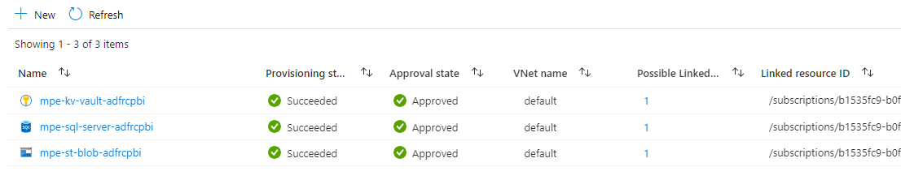
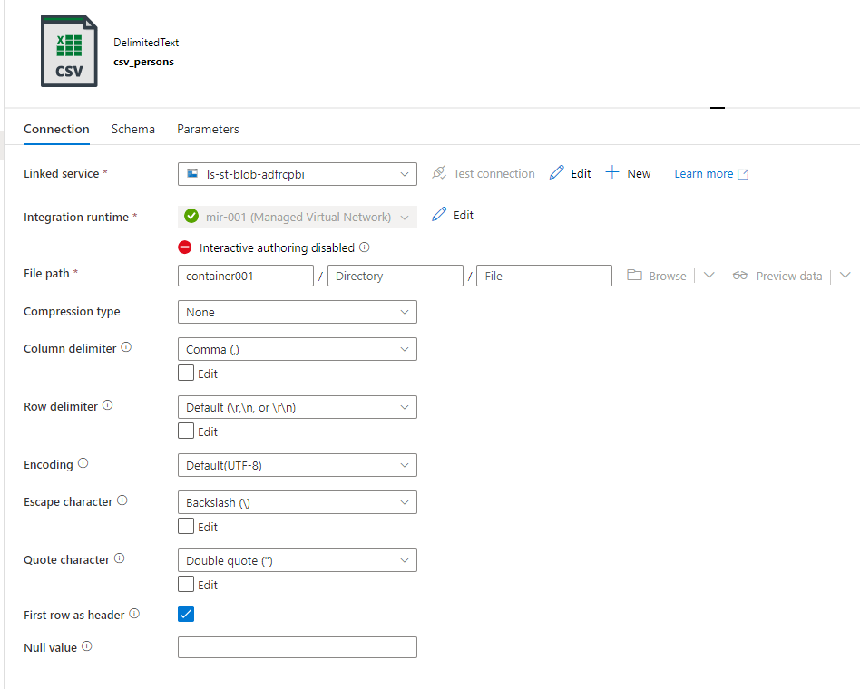

# Azure Data Factory using Managed VNet

<!-- Replace "Recipe Template" title with name of the recipe. -->

## Scenario

<!-- Describe the usage scenario for this template.  Describe the challenges this recipes aims to address. -->
This scenario aims to address the challenge of correctly configuring an Azure Data Factory instance which utilizes a Managed VNet including appropriate connectivity with common services such as Azure Storage, Azure SQL and Azure Key Vault while keeping connections private.

### Problem Summary

<!--Briefly describe the problme that this recipe intends to resolve or make easier. -->
By default, Azure Data Factory utilizes an auto-resolve Integration Runtime to connect to data sources. However, there are times when customers require this connection to be completely private, particularly when the data sources themselves restrict any public access.

Azure Data Factory (ADF) has a concept of a [Managed VNet](https://docs.microsoft.com/azure/data-factory/managed-virtual-network-private-endpoint) in order to ensure traffic between the Auto-Resolved Integration Runtime (IR) remains private while still being able offload the management of the Integration Runtime and the VNet itself. This requires creation of Managed Private Endpoints within this Managed VNet in order to facilitate the connection between the IR and the target data sources such as Azure Storage and Azure SQL.

The ADF portal also supports connecting over a Private Endpoint to facilitate authoring ADF pipelines over a Private Connection*. Furthermore, Azure Data Factory typically requires a connection to Azure Key Vault in order to retrieve secrets through a private connection.

Benefits of using Managed Virtual Network:

- With a Managed Virtual Network, you can offload the burden of managing the Virtual Network to Azure Data Factory. You don't need to create a subnet for Azure Integration Runtime that could eventually use many private IPs from your Virtual Network and would require prior network infrastructure planning.
- It does not require deep Azure networking knowledge to do data integrations securely. Instead getting started with secure ETL is much simplified for data engineers.
- Managed Virtual Network along with Managed private endpoints protects against data exfiltration.

This recipe aims to provide developers a starting point with IaC example of deploying Azure Data Factory instance which utilizes a Managed VNet while still being able to connect to common additional services such as Azure Storage, Azure SQL and Azure Key Vault.

** Note: as of Feb 2022, while you can configure a Private Endpoint for the ADF portal, [you can still access the ADF portal through a public network](https://docs.microsoft.com/azure/data-factory/data-factory-private-link).

### Architecture

<!-- Include a high-level architecture diagram of the components used in this recipe. -->


### Recommendations

The following sections provide recommendations on when this recipe should, and should not, be used.

#### Recommended

<!-- Provide details on when usage of this recipe is recommended. -->
This recipe is recommended if the following conditions are true:

- Utilize a Managed VNet for your ADF Integration runtime.

#### Not Recommended

<!-- Provide details on when usage of this recipe is NOT recommended. -->
This recipe is **not** recommended if the following conditions are true:

- If you require utilizing a Self-Hosted Integration Runtime such as when reading from on-premises sources.

## Getting Started

<!-- Provide instructions on how a user would use this recipe (e.g., how they would deploy the resources). -->

### Pre-requisites

<!-- List the pre-reqs for use of this recipe (SDKs, roles/permissions, etc.) -->
The following pre-requisites should be in place in order to successfully use this recipe:

- [Azure CLI](https://docs.microsoft.com/cli/azure/install-azure-cli)
- [jq](https://formulae.brew.sh/formula/jq)
- [Bicep](https://docs.microsoft.com/azure/azure-resource-manager/bicep/install) (Only if using Azure Bicep)

### Deployment

The recipe will deploy the following resources:

- VNet
- Azure Data Factory
- Azure SQL
- Azure Storage Account
- Azure Key Vault
- Corresponding private endpoints and managed private endpoints
  
To deploy this recipe, we shall first deploy the Bicep project which will create all the Azure resources. Then we shall run a script to approve the private endpoints.

The steps of deployment are summarised below:

- Create a new Azure resource group to deploy the Bicep template, passing in a location and name.

```bash
az group create --location <LOCATION> --name <RESOURCE_GROUP_NAME>
```

- The [azuredeploy.parameters.json.sample](./deploy/bicep/azuredeploy.parameters.json.sample) file contains the necessary variables to deploy the Bicep project. Rename the file to **azuredeploy.parameters.json** and update the file with appropriate values. Descriptions for each parameter can be found in the [main.bicep](./deploy/bicep/main.bicep) file.

- Optionally, verify what Bicep will deploy, passing in the name of the resource group created earlier and the necessary parameters for the Bicep template.

```bash
az deployment group what-if --resource-group <RESOURCE_GROUP_NAME> --template-file .\main.bicep --parameters .\azuredeploy.parameters.json --verbose
```

- Deploy the template, passing in the name of the resource group created earlier and the necessary parameters for the Bicep template.

```bash
az deployment group create --resource-group <RESOURCE_GROUP_NAME> --template-file .\main.bicep --parameters .\azuredeploy.parameters.json --verbose
```

The Bicep deployment will create the managed private endpoint in Azure Data Factory. But the endpoints are still not approved at this stage.


- Run the `approve-managed-private-endpoints.sh` script to approve the endpoints.

```bash
./approve-managed-private-endpoints.sh <resourceGroupName> <storageAccountName> <keyVaultName> <sqlServerName> <mpeStorageAccountName> <mpeKeyVaultName> <mpeSqlServerName>
```



## Test the Recipe

The Azure SQL, Storage Account and Key Vault are deployed in a private VNet. To test the recipe, we shall build a pipeline in the ADF instance that connects to these 3 services.

As these 3 services are deployed in private VNet without any public access, we shall use Azure Bastion service to access these resources. For that, we would deploy a windows VM and connect to it via Azure Basion as instructed below:

- Create a Windows virtual machine in the Azure portal ([Documentation](https://docs.microsoft.com/azure/virtual-machines/windows/quick-create-portal)).

Deploy the virtual machine in the same application VNet which was created during the Bicep deployment. As this VNet is already linked to private DNS Zones and has private endpoints configured, you shall be able to connect to the ADF instance.

- Configure Bastion and connect to a Windows VM ([Documentation](https://docs.microsoft.com/azure/bastion/tutorial-create-host-portal)).
  For convenience, the VNet we created earlier already has a subnet called *AzureBastionSubnet* which is required for provisioning this service.

When you use Bastion to connect, the VM does not need a public IP address or special software. After deploying Bastion, you can remove the public IP address from your VM if it is not needed for anything else. Next, you connect to a VM via its private IP address using the Azure portal.

Next we shall create table and insert data to the SQL Server.

- Connect to the VM using the Bastion service.
- Log in to the Azure SQL Server. Use the following script to create a table and insert few records in the table.

```bash
CREATE TABLE persons (
    id int,
    LastName varchar(255),
    FirstName varchar(255)
);
insert into [dbo].[persons] values (1, 'Jose', 'Martin')
insert into [dbo].[persons] values (2, 'Madden', 'Long')
insert into [dbo].[persons] values (3, 'Triston', 'Dalton')
```

- Open ADF studio and create a dataset pointing to the Azure SQL table ([Reference](https://docs.microsoft.com/azure/data-factory/concepts-datasets-linked-services?tabs=data-factory)). Use the linked service to SQL database, which has been created as part of the Bicep deployment (Default name: `ls-sql-db-${baseName}`), to create the dataset.
  


- Create another dataset pointing to the storage account ([Reference](https://docs.microsoft.com/azure/data-factory/concepts-datasets-linked-services?tabs=data-factory)). Use the linked service to storage account, which has been created as part of the Bicep deployment (Default name: `ls-st-blob-${baseName}`), to create the dataset. Also select the container `container001` as output file path.



- Create a pipeline and drag a copy activity in it. Use the SQL dataset as source and CSV dataset as sink.
- Run the pipeline. If the pipeline runs successfully, an output file should be created in the container `container001`.


This confirms the connecitvity to Azure SQL and Storage Account. To test the connectivity to Key Vault, we shall change the linked service to Azure SQL. We shall take the password from a Key Vault secret for the linked service.

- Create a secret in the Key Vault to save the password of Azure SQL Server.
- Open the linked service to Azure SQL and point the password field to the Key Vault secret. Test the connection to the Key Vault by using the `Test Connection` button.


