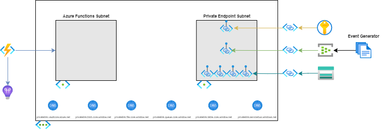
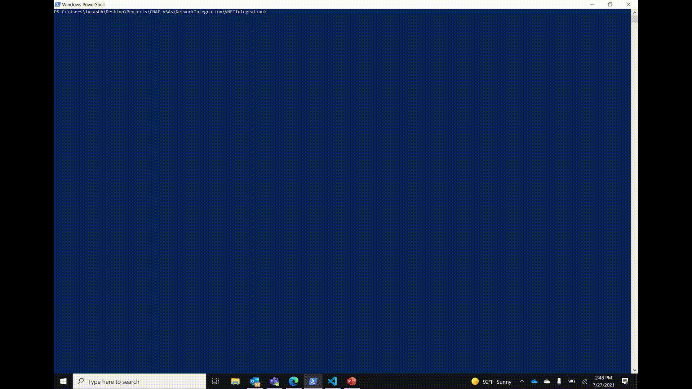

# Azure Functions with Private Event Hub

## Scenario

The recipe addresses a scenario where messages sent privately through an Event Hub in a virtual network trigger an Azure Functions based workload. Integration between Event Hubs and Azure Virtual Networks creates a secure messaging layer that can be accessed from other services in the network. Azure Functions can be similarly integrated with services inside virtual networks, enabling creation of workloads that execute on message ingestion, through input bindings.

Azure Private Link and Private Endpoints facilitate the connection between Event Hub and the virtual network, assigning a private IP address from the virtual network to the messaging service, bringing it into the VNet through a specific 'Private Endpoint' subnet. An Azure Function is assigned to a second, 'Azure Functions' subnet, that allows it to receive traffic from services inside the network. Importantly, the Event Hub is configured to receive traffic from the 'Azure Functions' subnet and is inaccessible from other address spaces in and outside the VNet.

The Function App has an associated private endpoint enabled Storage Account, whose various endpoints (blob, table, file, etc.) each have a dedicated Private Endpoint deployed into the same 'Private Endpoint' subnet. The subnet also contains the Private Endpoint for a Key Vault that has been integrated with the network and contains secrets relevant for the Function App. The Function App contains a single .NET Event Hub triggered Function ([EventHubProcessor.cs](../common/app_code/eventhub-trigger/EventHubProcessor.cs)) that logs the message content when a new message is received.

### Problem Summary

There are numerous challenges to configuring an Azure Function to consume events from a private endpoint enabled Event Hub. In addition to the private Event Hub, Azure Functions in this scenario are often configured with private endpoints for the required backend Azure Storage account and Key Vault (for application secrets, such as the Event Hub and Azure Storage connection strings). Azure Private DNS zones must be configured. Numerous Azure Function application settings need to be configured. Getting the configuration correct can be tedious and often error prone. This recipe attempts to make such configuration easier by providing both Terraform and Bicep assets to serve as a starting point to understand how to configure a private endpoint enabled Event Hub and consuming Azure Function.

### Architecture



### Recommendations

The following sections provide recommendations on when this recipe should, and should not, be used.

#### Recommended

This recipe is recommended if the following conditions are true:

- Architecture requires isolated, private networking relationship between messaging service and triggered workload.
- All services within architecture are managed by the same owners, reducing overhead for Private Link approvals.
- Enterprise level access controls needs for management and usage of secrets.

#### Not Recommended

This recipe is **not** recommended if the following conditions are true:

- Messaging service must be publicly (Internet) accessible.
- Cost concerns prevent usage of Azure Functions Elastic Premium tier or Event Hub Standard tier.

## Getting Started

### Pre-requisites

The following are pre-requisites to use this recipe:

- [Azure CLI](https://docs.microsoft.com/en-us/cli/azure/install-azure-cli)
- [Azure Functions Core Tools](https://docs.microsoft.com/en-us/azure/azure-functions/functions-run-local?tabs=windows%2Ccsharp%2Cbash#install-the-azure-functions-core-tools)
- [.NET](https://docs.microsoft.com/en-us/dotnet/core/install/)

### Deployment

To deploy this recipe, perform the infrastructure deployment steps using _either_ Terraform or Bicep before deploying the Azure Functions code.

### Remote Access

The recipe does not provision a Virutal Machine (VM) or Azure Bastion to provide remote access within the virtual network.  If a VM or Bastion is needed, modify the virtual network topology to add the necessary subnets (for example, add subnets "snet-vm" for the VM and "AzureBastionSubnet" for Azure Bastion).

#### Virtual Network

The recipe provides for the ability to deploy Azure resources to a hub/spoke virtual network model.  In the hub/spoke model, the recipe assumes Azure Private DNS zones reside in another resource group.  The recipe includes parameters/variables to control how Azure Private DNS Zones are used - either use existing Private DNS Zones, or create new Private DNS Zones.

#### Deploying Infrastructure Using Terraform

The following is an additional pre-requisite to use this recipe:

- [Terraform](https://www.terraform.io/downloads.html)

1. The [terraform.tfvars.sample](./deploy/terraform/terraform.tfvars.sample) file contains the necessary variables to apply the terraform configuration. Rename the file to **terraform.tfvars** and update the file with appropriate values. Descriptions for each variable can be found in the [variables.tf](./deploy/terraform/variables.tf) file.
1. Initialize terraform - `terraform init`
1. Optionally, verify what terraform will deploy - `terraform plan`
1. Deploy the configuration - `terraform apply`


> **_NOTE:_** The project contains a [deploy.sh](./deploy/terraform/deploy.sh) script file that uses similar steps to those above, as well as virtual network peering support (if needed).
>
> **_NOTE:_**  Terraform (as of February 2022) does not support setting Network Access to 'Disabled' on Event Hub namespaces. The project offers the same functionality via the 'Selected Networks' option, restricting traffic from outside the virtual network. Please refer to <https://github.com/hashicorp/terraform-provider-azurerm/issues/14947> for additional information.

#### Deploying Infrastructure Using Bicep

The following is an additional pre-requisite to use this recipe:

- [Bicep](https://docs.microsoft.com/en-us/azure/azure-resource-manager/bicep/install)

1. Create a new Azure resource group to deploy the Bicep template to, passing in a location and name.
  
    ```bash
    az group create --location <LOCATION> --name <RESOURCE_GROUP_NAME>
    ```

1. The [azuredeploy.parameters.sample.json](./deploy/bicep/azuredeploy.parameters.sample.json) file contains the necessary variables to deploy the Bicep project. Rename the file to **azuredeploy.parameters.json** and update the file with appropriate values. Descriptions for each parameter can be found in the [main.bicep](./deploy/bicep/main.bicep) file.
   1. Set the `newOrExistingDnsZones` parameter to "new" (or don't set, as the default is "new") if creating a new Azure Private DNS Zone.
   1. Set the `dnsZoneResourceGroupName` parameter to the name of your resource group (or don't set, as the default is the name of the resource group) if creating a new Azure Private DNS Zone.
1. Optionally, verify what Bicep will deploy, passing in the name of the resource group created earlier and the necessary parameters for the Bicep template.

    ```bash
    az deployment group what-if --resource-group <RESOURCE_GROUP_NAME> \
    --template-file .\main.bicep \
    --parameters .\azuredeploy.parameters.json \
    --verbose
    ```

1. Deploy the template, passing in the name of the resource group created earlier and the necessary parameters for the Bicep template

    ```bash
    az deployment group create --resource-group <RESOURCE_GROUP_NAME> \
    --template-file .\main.bicep \
    --parameters .\azuredeploy.parameters.json \
    --verbose
    ```

> **_NOTE:_** The project contains a [deploy.sh](./deploy/bicep/deploy.sh) script file that uses similar steps to those above, as well as virtual network peering support (if needed).


#### Deploying Function Code

The project provides sample Azure Function code to verify that the solution is working correctly, but is not strictly necessary for the recipe.

1. Navigate to the [../common/app_code/eventhub-trigger](../common/app_code/eventhub-trigger) directory.
1. Deploy the code to the function app provisioned by terraform.

    ```bash
    func azure functionapp publish <NAME_OF_FUNCTION_APP_PROVISIONED_BY_TERRAFORM_OR_BICEP> --dotnet
    ```



### Testing Solution

To verify the solution is working as intended, the Function App contains a second timer-triggered Azure Function ([Tester.cs](../common/app_code/eventhub-trigger/Tester.cs)) that sends messages to the Event Hub every minute, triggering the EventHubProcessor, but is disabled by default. The Event Hub is already configured to accept traffic from the subnet that contains the Function App, so no additional configuration is necessary to allow the Azure Function to work appropriately. Perform the following steps to test the solution:

1. Navigate to the [Azure Portal](https://portal.azure.com) and find the Function App provisioned by Bicep or Terraform earlier.
1. Open the **Configuration** blade.
1. Find the `AzureWebJobs.Tester.Disabled` application setting and edit the value to `false`.
1. Save the changes.
1. Open the **Functions** blade and select **EventHubProcessor**
1. Open the **Monitor** blade and navigate to the **Logs** tab
1. Observe the Azure Function processing messages.


The solution could also be tested using a jumpbox VM deployed into the VNet and the Service Bus Explorer to send messages to the Private Endpoint enabled Event Hub. The process requires additional steps to allow traffic from the VM subnet, with further installations and steps on the VM itself, which are out of scope for this document.

## Change Log

- 2022-10-08 - Support AzureRM 3.25.0 and Terraform 1.3.2.
- 2022-04-14
  - Terraform - remove Virtual Machine and Azure Bastion, and support hub/spok virtual network with Azure Private DNS Zones (similar to prior changes for Azure Bicep version).
- 2022-04-01
  - Support a hub/spoke virtual network with Azure Private DNS Zones in hub (different resource group).
  - Azure Bicep - remove Virtual Machine and Azure Bastion
- 2022-03-01
  - Set Event Hub and Azure Storage secret (connection string) as a Key Vault secret in the respective modules.
  - Updated Event Hub network access from "Selected Networks" to "Disabled" (allowing access via private endpoint only).
- 2021-07-20
  - Initial check-in of recipe.

## Next Steps

- The Azure Function that processes the Event Hub message currently logs the message, but can be extended to take more advanced action on message ingestion. Consider updates to the Function code to write a record to a durable data store, trigger another event based system, etc.
- Consider creating DevOps build and release pipelines that can validate and apply the Bicep or Terraform versions of the infrastructure to automate the deployment process. As a starting point, the repository contains an [event-hub-recipe-ci.yml](../../.azuredevops/pipelines/event-hub-recipe-ci.yml) pipeline that builds the infrastructure templates and .NET Function code, as well as [event-hub-recipe-cd-bicep.yml](../../.azuredevops/pipelines/event-hub-recipe-cd-bicep.yml) and [event-hub-recipe-cd-terraform.yml](../../.azuredevops/pipelines/event-hub-recipe-cd-terraform.yml) pipelines that deploy the Bicep or Terraform versions of the recipe along with the Azure Function code.
