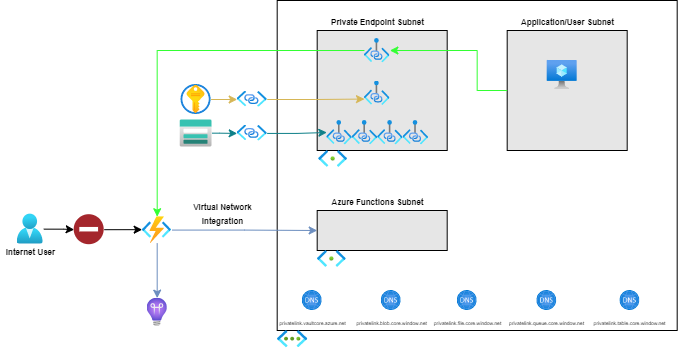

# Azure Function with Private HTTP Endpoint

## Scenario

This recipe addresses a scenario where there is a requirement to restrict HTTP/S access to an Azure Function to a specific virtual network. In this scenario, only clients which are connected to the specified virtual network are able to access the Azure Function.

The Azure Function is configured with an (inbound) [Private Endpoint](https://docs.microsoft.com/azure/app-service/networking/private-endpoint). The function's Private Endpoint is assigned an IP address from the specified Private Endpoint subnet.

> When a Private Endpoint is enabled on the Azure Function, public Internet access is automatically disabled. This applies to the primary site (e.g., <https://contoso.azurewebsites.net>) and the Kudu/SCM site (e.g., <https://contoso.scm.azurewebsites.net>).

Additionally, the function uses [regional virtual network integration](https://docs.microsoft.com/azure/app-service/web-sites-integrate-with-vnet#regional-vnet-integration) to communicate with other Azure services connected to, or integrated with, the same virtual network. The function app has an associated Private Endpoint enabled Azure Storage account, whose various endpoints (blob, table, file, etc.) each have a dedicated Private Endpoint deployed into the same 'Private Endpoint' subnet. The subnet also contains the Private Endpoint for a Key Vault that has been integrated with the network and contains secrets relevant to the function app.

Finally, this recipe is configured to use a Linux Azure Functions Premium plan. A sample Python function is included.

### Problem Summary

There are numerous challenges to configuring an Azure Function to be accessible only via a private virtual network using Private Endpoints. An Azure Function in this scenario is often configured with Private Endpoints for the required backend Azure Storage account and Key Vault (for application secrets such as the Azure Storage connection strings). Azure Private DNS zones must be configured. Numerous Azure Function application settings need to be configured. Getting the configuration correct can be tedious and often error prone. This recipe attempts to make such configuration easier by providing both Terraform and Bicep assets to serve as a starting point to understand how to configure an (inbound) Private Endpoint for the Azure Function.

### Architecture



### Recommendations

The following sections provide recommendations on when this recipe should, and should not, be used.

#### Recommended

This recipe is recommended if the following conditions are true:

- Requirement that the Azure Function's HTTP/S endpoint is accessible only from within the designated virtual network.
- Requirement for private (virtual network) connectivity to Azure Function's backend Azure Storage Account.
- Requirement for private (virtual network) connectivity to the Azure Key Vault used for persisting Azure Function secrets.
- Ability to use Azure Private DNS Zones.
- Ability to use a virtual network connected agent (i.e., self-hosted agent or runner) to deploy application code to the Azure Function.

#### Not Recommended

<!-- Provide details on when usage of this recipe is NOT recommended. -->

This recipe is **not** recommended if the following conditions are true:

- Azure Function's HTTP/S endpoint is accessible from the public Internet.
- Requirement to use custom DNS zones. Custom DNS zones are not yet supported on Linux Azure Functions with Private Endpoints for the backend Azure Storage account.

## Getting Started

<!-- Provide instructions on how a user would use this recipe (e.g., how they would deploy the resources). -->

### Pre-requisites

The following pre-requisites should be in place in order to successfully use this recipe:

- [Azure CLI](https://docs.microsoft.com/en-us/cli/azure/install-azure-cli)
- [Azure Functions Core Tools](https://docs.microsoft.com/en-us/azure/azure-functions/functions-run-local?tabs=windows%2Ccsharp%2Cbash#install-the-azure-functions-core-tools)
- [Python 3.8](https://www.python.org/downloads/release/python-3811/)

### Deployment

To deploy this recipe, perform the infrastructure deployment steps using _either_ Terraform or Bicep before deploying the Azure Functions code.

### Remote Access

The recipe does not provision a Virutal Machine (VM) or Azure Bastion to provide remote access within the virtual network.  If a VM or Bastion is needed, modify the virtual network topology to add the necessary subnets (for example, add subnets "snet-vm" for the VM and "AzureBastionSubnet" for Azure Bastion).

#### Virtual Network

The recipe provides for the ability to deploy Azure resources to a hub/spoke virtual network model.  In the hub/spoke model, the recipe assumes Azure Private DNS zones reside in another resource group.  The recipe includes parameters/variables to control how Azure Private DNS Zones are used - either use existing Private DNS Zones, or create new Private DNS Zones.

#### Deploying Infrastructure Using Terraform

The following is an additional pre-requisite to use this recipe:

- [Terraform](https://www.terraform.io/downloads.html)

1. The [terraform.tfvars.sample](./deploy/terraform/terraform.tfvars.sample) file contains the necessary variables to apply the terraform configuration. Rename the file to **terraform.tfvars** and update the file with appropriate values. Descriptions for each variable can be found in the [variables.tf](./deploy/terraform/variables.tf) file.
1. Initialize terraform - `terraform init`
1. Optionally, verify what terraform will deploy - `terraform plan`
1. Deploy the configuration - `terraform apply`


> **_NOTE:_** The project contains a [deploy.sh](./deploy/terraform/deploy.sh) script file that uses similar steps to those above, as well as virtual network peering support (if needed).

#### Deploying Infrastructure Using Bicep

The following is an additional pre-requisite to use this recipe:

- [Bicep](https://docs.microsoft.com/azure/azure-resource-manager/bicep/install)

1. Create a new Azure resource group to deploy the Bicep template, passing in a location and name.

    ``` bash
    az group create --location <LOCATION> --name <RESOURCE_GROUP_NAME>
    ```

1. The [azuredeploy.parameters.sample.json](./deploy/bicep/azuredeploy.parameters.sample.json) file contains the necessary variables to deploy the Bicep project. Rename the file to **azuredeploy.parameters.json** and update the file with appropriate values. Descriptions for each parameter can be found in the [main.bicep](./deploy/bicep/main.bicep) file.
   1. Set the `newOrExistingDnsZones` parameter to "new" (or don't set, as the default is "new") if creating a new Azure Private DNS Zone.
   1. Set the `dnsZoneResourceGroupName` parameter to the name of your resource group (or don't set, as the default is the name of the resource group) if creating a new Azure Private DNS Zone.
1. Optionally, verify what Bicep will deploy, passing in the name of the resource group created earlier and the necessary parameters for the Bicep template.

    ```bash
    az deployment group what-if --resource-group <RESOURCE_GROUP_NAME> \
      --template-file .\main.bicep \
      --parameters .\azuredeploy.parameters.json \
      --verbose
    ```

1. Deploy the template, passing in the name of the resource group created earlier and the necessary parameters for the Bicep template.

    ``` bash
    az deployment group create --resource-group <RESOURCE_GROUP_NAME> \
      --template-file .\main.bicep \
      --parameters .\azuredeploy.parameters.json \
      --verbose
    ```

> **_NOTE:_** The project contains a [deploy.sh](./deploy/bicep/deploy.sh) script file that uses similar steps to those above, as well as virtual network peering support (if needed).


#### Deploying Function Code

Using Private Endpoints to secure Azure Functions not only ensures that the Function host is publicly inaccessible, but also blocks requests to the Function App's SCM endpoint, used for deployment of code. As a result, publishing code from a local machine is not possible as the SCM endpoint is secured within the provisioned virtual network. The following approaches can be taken in order to deploy code to the Private Endpoint secured Function app:

- Use GitHub to push code to a new repository and the Azure Function Deployment Center to deploy the code from the repository into the Function App ([Microsoft Docs](https://docs.microsoft.com/en-us/azure/azure-functions/functions-create-vnet#deploy-a-service-bus-trigger-and-http-trigger)).
- Use GitHub to push code to a new repository, then connect to the VM jumpbox provisioned by Terraform or Bicep using Bastion, clone the project and deploy using `func azure functionapp publish`. The VM does not have any of pre-requisite dev tools installed automatically, so installing the necessary packages (Core Tools, Azure CLI, Python, etc.) on the machine is required before publishing.
- Before using the recipe, deploy a virtual network with agents that contain the project code, then utilize those (self-hosted) agents in a pipeline that allows for automated deployment of code to the Function app.
- Connect the local machine to the virtual network using Point-to-Site, then publish normally from the local machine using `func azure functionapp publish` ([Microsoft Docs](https://docs.microsoft.com/en-us/azure/vpn-gateway/point-to-site-about)).

### Testing Solution

To verify the solution is working as intended, the Function App contains a single Python based HTTP triggered Azure Function ([init.py](../common/app_code/http-trigger/HTTPRequestProcessor/__init__.py)) that accepts an optional name query string parameter and returns a basic string to the caller. The endpoint should return a 200 to requests that originate from _inside_ the virtual network and disallow requests from address spaces outside the network:

1. Navigate to the [Azure Portal](https://portal.azure.com) and find the Function App provisioned by Bicep or Terraform earlier.
1. Open the **Functions** blade and select **HTTPRequestProcessor**
1. Find the **Get Function Url** menu item and copy the url to the clipboard.
1. Open a Powershell window and make a curl request to the url - `curl <FUNCTION_URL>`
1. Observe the following error - "The remote name could not be resolved:"
1. Navigate back to the [Azure Portal](https://portal.azure.com) and find the Virtual Machine provisioned by Bicep or Terraform earlier.
1. Open the **Connect** blade and select **Bastion**
1. Click the **Use Bastion** button and input the admin username and password that were created in the variables file during Bicep or Terraform deployment.
1. Once the connection to the VM is established, open a Powershell window and make a curl request to the url - `curl <FUNCTION_URL>`
1. Observe a 200 response with the following content - "This HTTP triggered function executed successfully. Pass a name in the query string or in the request body for a personalized response."


## Change Log

- 2022-12-19 - Upgrade Azure Functions to version 4.
- 2022-10-10 - Support AzureRM 3.25.0 and Terraform 1.3.2.
- 2022-04-14
  - Terraform - remove Virtual Machine and Azure Bastion, and support hub/spok virtual network with Azure Private DNS Zones (similar to prior changes for Azure Bicep version).
- 2022-04-01
  - Support a hub/spoke virtual network with Azure Private DNS Zones in hub (different resource group).
  - Azure Bicep - remove Virtual Machine and Azure Bastion
- 2022-03-01
  - Set Azure Storage secret (connection string) as a Key Vault secret in the private Azure Storage module.
- 2021-08-16
  - Initial check-in of recipe.

## Next Steps

- The Azure Function that processes the HTTP request currently logs the supplied query string name parameter, but can be extended to take more advanced action. Consider updates to the Function code to write a record to a durable data store, trigger an event based system, etc.
- Consider creating DevOps build and release pipelines that can validate and apply the Bicep or Terraform versions of the infrastructure to automate the deployment process. As a starting point, the repository contains an [private-http-recipe-ci.yml](../../.azuredevops/pipelines/private-http-recipe-ci.yml) pipeline that builds the infrastructure templates and Python Function code. In order to deploy the Function code via CD pipeline, an agent pool that uses self-hosted agents deployed into the virtual network must be utilized.

## Important Notes

- Accessing [network restricted Key Vaults](https://docs.microsoft.com/en-us/azure/app-service/app-service-key-vault-references#access-network-restricted-vaults) from Linux-based Azure Functions currently requires the `vnetRouteAllEnabled` site configuration property and the `WEBSITE_VNET_ROUTE_ALL` application setting to be set to true. The settings will no longer be required following the release of Azure Antares 95, expected to be rolled out to Azure regions in August 2021, and can be omitted from the templates.
