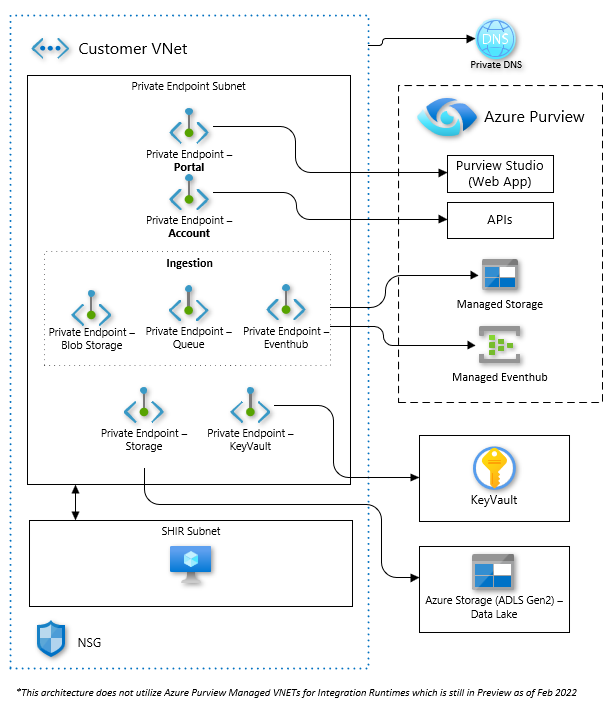
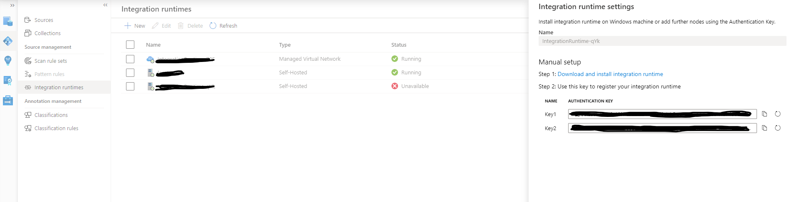
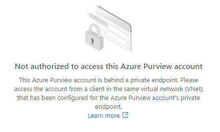
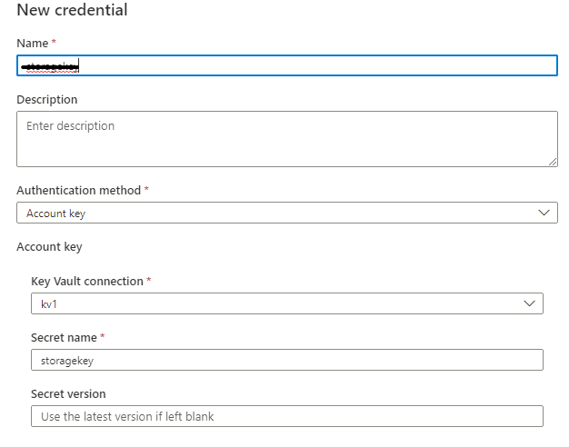
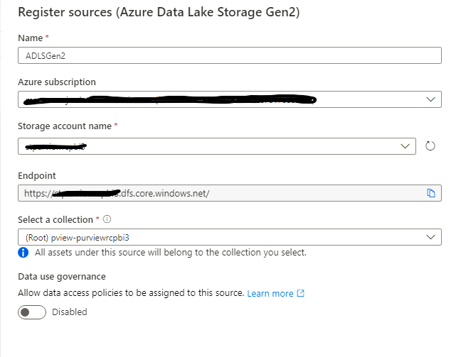
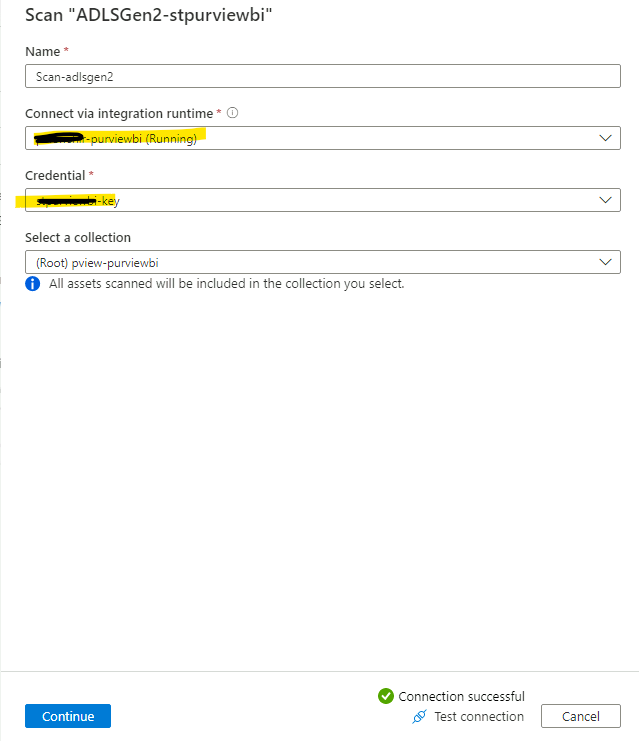
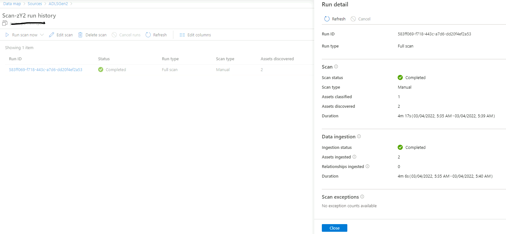
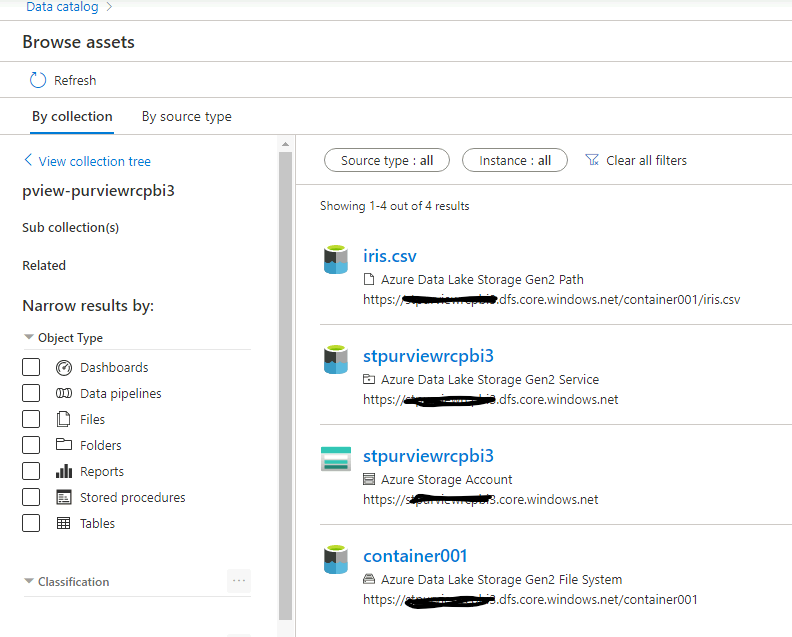

# Azure Purview in a VNet

<!-- Replace "Recipe Template" title with name of the recipe. -->

## Scenario

<!-- Describe the usage scenario for this template.  Describe the challenges this recipes aims to address. -->
This scenario aims to address the challenge of correctly configuring an Azure Purview instance within a VNet including ensuring appropriate connectivity with common services such as Storage and Key Vault while keeping connections private.

### Problem Summary

<!--Briefly describe the problme that this recipe intends to resolve or make easier. -->
While Azure Purview seemingly is a single service, it is actually composed of three main "sub-components" from a networking perspective: Portal, Account, and Ingestion. See [here](https://docs.microsoft.com/azure/purview/catalog-private-link#conceptual-overview) for more information on these. The Ingestion piece specifically calls for three additional Private Endpoints due to the Managed Storage (both queues and blob) and Azure Event Hub utilized by Azure Purview. In addition to this, when utilizing Private Endpoints for Ingestion, Azure Purview requires using a Self-Hosted Integration Runtime* in order to scan the target data sources (such as Azure Storage), and therefore requires a network line-of-site to these services, which themselves maybe behind a Private Endpoint. Lastly, Azure Purview also requires an Azure Key Vault for secret storage.

This recipe aims to provide developers a starting point with IaC example of an Azure Purview with all sub-component correctly configured to ensure traffic stays private, while still being able to retrieve secrets from Azure Key Vault and connect to sample Storage Account for scanning and ingestion of metadata.

**Note: [Azure Purview Managed VNets](https://docs.microsoft.com/azure/purview/catalog-managed-vnet) for Integration runtimes is currently in limited Public Preview, and is not used in this recipe.*

### Architecture

<!-- Include a high-level architecture diagram of the components used in this recipe. -->


### Recommendations

The following sections provide recommendations on when this recipe should, and should not, be used.

#### Recommended

This recipe is recommended if the following conditions are true:

- You want to make all traffic of your Azure Purview instance and sub-components private.

#### Not Recommended

This recipe is **not** recommended if the following conditions are true:

- You have requirements not supported by the [known limitations](https://docs.microsoft.com/azure/purview/catalog-private-link-troubleshoot) of using Private Endpoints for Azure Purview.
- You require Azure Purview portal to be access publicly.

## Getting Started

### Pre-requisites

The following pre-requisites should be in place in order to successfully use this recipe:

- [Azure CLI](https://docs.microsoft.com/cli/azure/install-azure-cli)
- [Bicep](https://docs.microsoft.com/azure/azure-resource-manager/bicep/install) (Only if using Azure Bicep)
- [Terraform](https://developer.hashicorp.com/terraform/downloads?product_intent=terraform) (Only if using Azure Bicep)
- [Azure PowerShell](https://docs.microsoft.com/powershell/azure/install-az-ps) (Only if using Azure PowerShell to deploy via Azure Bicep)

### Deployment

There are three parts in this deployment:

1. Deploy main Azure Purview recipe.
2. Create Self-Hosted Integration Runtime (SHIR) in Azure Purview.
3. Deploy VM scale set to act as the Purview SHIR.
  
#### 1. Deploy main Azure Purview Recipe

This recipe is available in Bicep and Terraform.

#### Using Bicep

To deploy this recipe using Bicep, please perform the following actions:

- Create a new Azure resource group to deploy the Bicep template, passing in a location and name.

```bash
az group create --location <LOCATION> --name <RESOURCE_GROUP_NAME>
```

- The [azuredeploy.parameters.sample.json](./deploy/bicep/azuredeploy.parameters.sample.json) file contains the necessary variables to deploy the Bicep project. Rename the file to **azuredeploy.parameters.json** and update the file with appropriate values. Descriptions for each parameter can be found in the [main.bicep](./deploy/bicep/main.bicep) file.

- Optionally, verify what Bicep will deploy, passing in the name of the resource group created earlier and the necessary parameters for the Bicep template.

```bash
az deployment group what-if --resource-group <RESOURCE_GROUP_NAME> --template-file .\main.bicep --parameters @.\azuredeploy.parameters.json --verbose
```

- Deploy the template, passing in the name of the resource group created earlier and the necessary parameters for the Bicep template.

```bash
az deployment group create --resource-group <RESOURCE_GROUP_NAME> --template-file .\main.bicep --parameters @.\azuredeploy.parameters.json --verbose
```

#### Using Terraform

To deploy this recipe using Terraform, please perform the following actions:

- The [terraform.tfvars.sample](./deploy/terraform/terraform.tfvars.sample) file contains the necessary variables to deploy the Terraform project. Rename the file to **terraform.tfvars** and update the file with appropriate values. Descriptions for each parameter can be found in the [variables.tf](./deploy/terraform/variables.tf) file.

- Initialize the working directory containing Terraform configuration files.

```bash
terraform init
```

- Optionally, verify what Terraform will deploy, passing the necessary parameters.

```bash
terraform plan -var-file=terraform.tfvars
```

- Deploy the resources with the necessary parameters.

```bash
terraform apply -var-file=terraform.tfvars
```

#### 2. Create Jumpbox to enabled deployment of Self-Hosted Integration Runtime (SHIR) in Azure Purview

Because the Azure Purview portal has public access disabled, these steps needs to be executed from a Virtual Machine (VM) in a VNet which has a network-line-of-site to Azure Purview. For simplicity, you can deploy this VM in the same application VNet which has been created as part of Bicep deployment as it has the required networking setup. Please follow the [Azure Documentation](https://docs.microsoft.com/azure/virtual-machines/linux/quick-create-portal) for detailed instructions.

Navigate to the Azure Purview portal > Data Map > Integration runtime. Click New > Self-Hosted. Give it a name and click Create. Copy one of the **Authentication Keys**. You will need this in the next step.


#### 3. Deploy Virtual Machine scale set to act as the Purview SHIR

This recipe comes with a Bicep deployment that deploys a [Virtual Machine Scale set](https://docs.microsoft.com/azure/virtual-machine-scale-sets/overview) and configures it to act the Purview SHIR. Deploy with the command below. Ensure the <RESOURCE_BASE_NAME> matches your previous deployment. If you did not set this in the parameter file, this would be an auto-generated string used repeatedly in all your deployment resource names (i.e., pview-<RESOURCE_BASE_NAME>).

```bash
az deployment group create \
    --resource-group <RESOURCE_GROUP_NAME> \
    --template-file .\shir.bicep \
    --parameters resourceBaseName=<RESOURCE_BASE_NAME> administratorUsername=<USERNAME> administratorPassword=<PASSWORD> purviewIntegrationRuntimeAuthKey=<SHIR_AUTHENTICATION_KEY> \
    --confirm-with-what-if
```

## Test the recipe

Navigate to the Azure Purview portal from the public internet. You should see the following error message due to the network access restrictions.


### Access over an Azure VM jumpbox and Azure Bastion

This is expected and the workspace can only be connected via private endpoints. For that, we would deploy a windows VM and connect to it via Azure Basion as instructed below:

- Create a Windows virtual machine in the Azure portal ([Documentation](https://docs.microsoft.com/azure/virtual-machines/windows/quick-create-portal))

Deploy the virtual machine in the same application VNet which was created during the Bicep deployment. As this VNet is already linked to private DNS Zones and has private endpoints configured, you shall be able to connect to the Azure Purview Workspace.

- Configure Bastion and connect to a Windows VM ([Documentation](https://docs.microsoft.com/azure/bastion/tutorial-create-host-portal))

When you use Bastion to connect, the VM does not need a public IP address or special software. After deploying Bastion, you can remove the public IP address from your VM if it is not needed for anything else. Next, you connect to a VM via its private IP address using the Azure portal.

With the above setup, you shall be able to access the Azure Purview from the Virtual Machine using Azure Bastion.

### Scan Storage from Azure Purview

To show connectivity between Azure Purview and Azure Storage and Azure Key Vault, you will be setting up a scan to in Azure Purview to scan a sample dataset within Azure Storage, while retrieving the Azure Storage Key from within Azure Key Vault. If you deployed the recipe using a Service Principal, you will need to grant yourself **Root Collection Admin** role to access the Purview Portal, the **Data Source Admin** role to managed the scans, and the **Data Curator** role to view and modify the data catalog objects ([Documentation](https://docs.microsoft.com/azure/purview/catalog-permissions))

1. Upload sample [Iris dataset](data/iris.csv) into the storage account container. ([Documentation](https://docs.microsoft.com/azure/storage/blobs/quickstart-storage-explorer#upload-blobs-to-the-container))
2. Store the Storage key as a secret in Key Vault.
   1. Grant yourself access to create secrets in Key Vault via access policies. ([Documentation](https://docs.microsoft.com/azure/key-vault/general/assign-access-policy?tabs=azure-portal))
   2. Retrieve the Storage account key and save it as a secret in Key Vault. ([Documentation](https://docs.microsoft.com/azure/key-vault/secrets/quick-create-portal))
3. **Create Key Vault Connection in Purview**. In the Azure Purview portal, under "Management > Credentials", select Manage Key Vault Connections and add the deployed Key Vault instance. ([Documentation](https://docs.microsoft.com/azure/purview/manage-credentials#create-azure-key-vaults-connections-in-your-azure-purview-account))
4. **Create Credential**. Create a new Credential utilizing the Key Vault connection and specifying the secret name containing the Storage key you created in the previous step.
  
5. **Register Data Source.** In the Azure Purview, register the Storage Account as a Data Source ([Documentation](https://docs.microsoft.com/azure/purview/register-scan-adls-gen2#register))
  
6. **Start a scan**. Selecting this newly registered Data Source, create **New Scan**. Ensure you select the Self-Hosted Integration Runtime you created as part of the recipe. Ensure you select the credential you created earlier. When it prompts you, select the container where you uploaded the sample dataset, set it to scan once, and then start the scan.



Once the scan completes, you should see the sample dataset metadata under "Browse Assets".


## Change Log

<!--
Describe the change history for this recipe. For example:
- 2021-06-01
  - Fix for bug in Terraform template that prevented Key Vault reference resolution for function app.
-->

## Next Steps

You can read the official documentation on Network Architecture best practices for Azure Purview [here](https://docs.microsoft.com/azure/purview/concept-best-practices-network)
<!-- Provide description and links to what a user of this recipe could do next.  Include suggestions for how the recipe could be enhanced or built upon. -->
