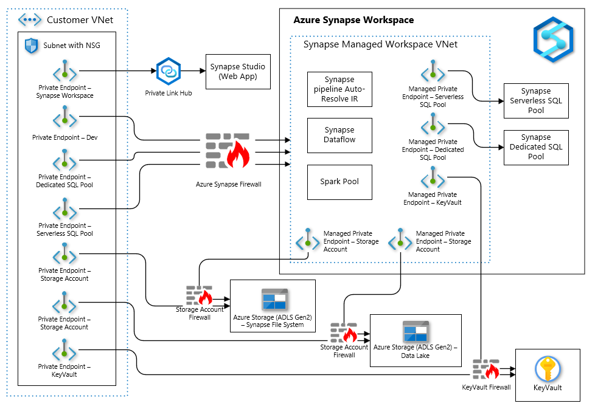
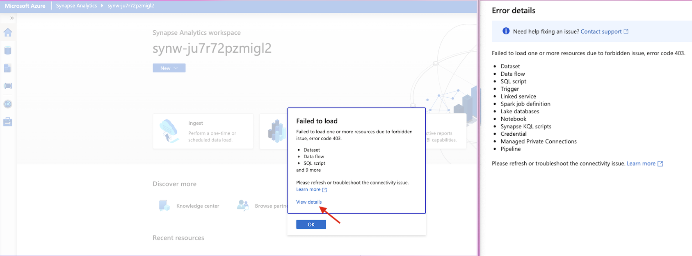
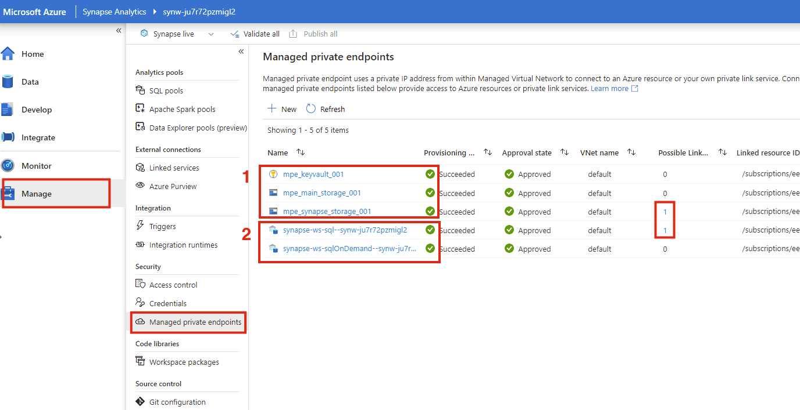
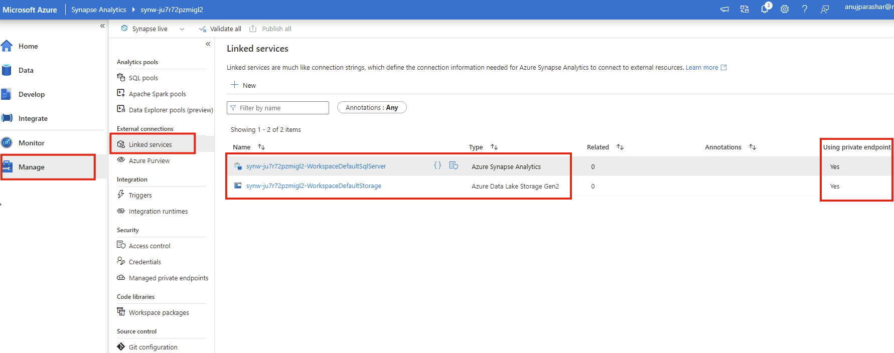
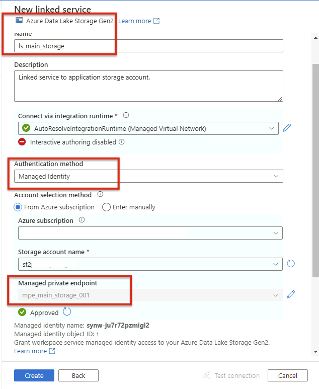
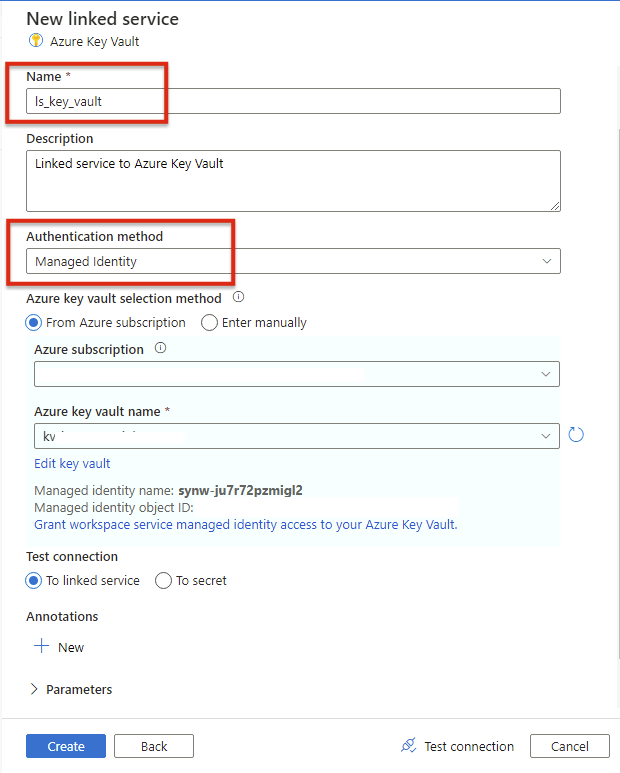
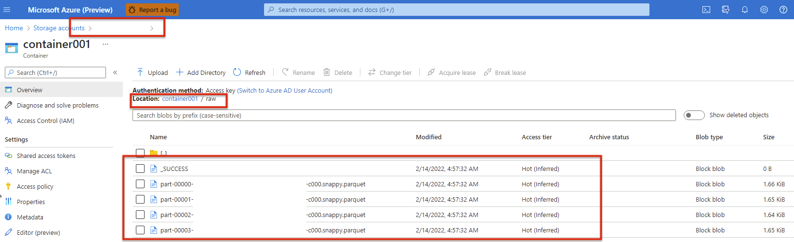
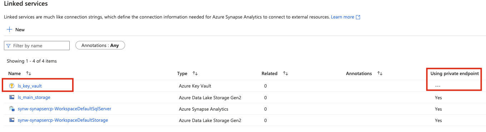
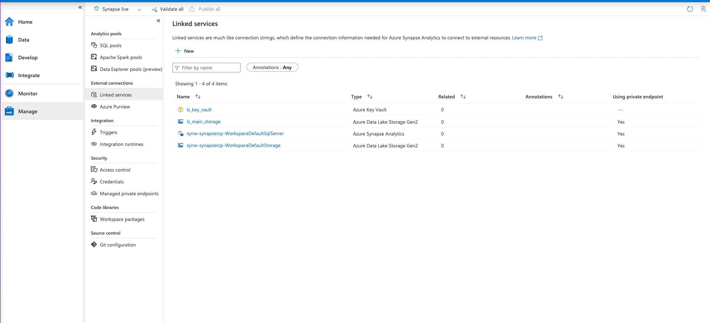

# Azure Synapse in a VNet

## Scenario

<!-- Describe the usage scenario for this template.  Describe the challenges this recipes aims to address. -->

This scenario aims to address the challenge of correctly configuring an Azure Synapse workspace within a VNet including ensuring appropriate connectivity with common services such as Storage and Key Vault.

### Problem Summary

<!--Briefly describe the problme that this recipe intends to resolve or make easier. -->
Azure Synapse is composed of a number of different services: Synapse Data Pipelines and Data Flows, SQL Dedicated pools, SQL Serverless pools, Spark pools and the newly added Data Explorer pools. Despite being under a single Synapse umbrella service, each of these sub-components require a slightly different VNet configuration treatment to properly isolate network traffic. For example, generally you need at least six Private Endpoints configured for a single workspace each with connecting to a different sub-component. Another example, while Spark Pools are generally a single tenant service with compute resources spun up within a designated Managed VNet, Synapse Serverless Pools are treated as a multi-tenanted resource and therefore require provisioning a Managed Private Endpoint within this Managed VNet in order to connect to it successfully.

In addition to this, customers will also need to ensure that traffic between the Azure Synapse workspace can still privately flow between the workspace components and additional Azure services such as Storage and Key Vault. This is done through the use of Private Endpoints.

This recipe aims to provide developers a starting point with IaC example of an Azure Synapse workspace with all sub-component (with the exemption of Data Explorer pools) correctly configured to ensure traffic stays private, while still being able to connect to common additional services such as Azure Storage and Azure Key Vault.

### Architecture

<!-- Include a high-level architecture diagram of the components used in this recipe. -->


This architecture heavily informed by [this article](https://techcommunity.microsoft.com/t5/azure-architecture-blog/understanding-azure-synapse-private-endpoints/ba-p/2281463).

### Recommendations

The following sections provide recommendations on when this recipe should, and should not, be used.

#### Recommended

<!-- Provide details on when usage of this recipe is recommended. -->
This recipe is recommended if the following conditions are true:

- You want to isolate traffic of your Synapse workspace and sub-components.
- You can't have public IPs for your Azure Synapse workspace and sub-components.

#### Not Recommended

<!-- Provide details on when usage of this recipe is NOT recommended. -->
This recipe is **not** recommended if the following conditions are true:

- Synapse workspace needs to be accessed publicly (however, you can modify the template to allow this).

## Getting Started

<!-- Provide instructions on how a user would use this recipe (e.g., how they would deploy the resources). -->

### Pre-requisites

The following pre-requisites should be in place in order to successfully use this recipe:

- [Azure CLI](https://docs.microsoft.com/cli/azure/install-azure-cli)
- [Bicep](https://docs.microsoft.com/azure/azure-resource-manager/bicep/install)

### Deployment

To deploy this recipe, please perform the following actions:

#### Deploying Infrastructure Using Bicep

- Open the command prompt and change directory to the `bicep` folder.

```bash
cd <WORKSPACE_LOCATION>/src/az-synapse/deploy/bicep
```

- Login to Azure CLI and set the subscription you want to use.

```bash
az login

az account set -s <subscription_id>
```

- Create a new Azure resource group to deploy the Bicep template, passing in a location and name.

```bash
az group create --location <LOCATION> --name <RESOURCE_GROUP_NAME>
```

- The [azuredeploy.parameters.sample.json](./deploy/bicep/azuredeploy.parameters.sample.json) file contains the necessary variables to deploy the Bicep project. Rename the file to **azuredeploy.parameters.json** and update the file with appropriate values. Descriptions for each parameter can be found in the [main.bicep](./deploy/bicep/main.bicep) file.

- Optionally, verify what Bicep will deploy, passing in the name of the resource group created earlier and the necessary parameters for the Bicep template.

```bash
az deployment group what-if --resource-group <RESOURCE_GROUP_NAME> --template-file main.bicep --parameters azuredeploy.parameters.json --verbose
```

- Deploy the template, passing in the name of the resource group created earlier and the necessary parameters for the Bicep template.

```bash
az deployment group create --resource-group <RESOURCE_GROUP_NAME> --template-file main.bicep --parameters azuredeploy.parameters.json --verbose
```

Please note down the value of the following output variables from the deployment:

```
outSynapseWorkspaceName
outSynapseDefaultStorageAccountName
outMainStorageAccountName
outKeyVaultName
```

- Create the managed private endpoints by executing the shell script [deploy-managed-private-endpoints.sh](./deploy/scripts/deploy-managed-private-endpoints.sh). This script requires five parameters which are the various resource names created in the previous step of Bicep deployment.

Because the Synapse workspace has public access disabled, this script needs to be executed from a Virtual Machine (VM) in a VNet which has access to the Synapse endpoints using private endpoints. For simplicity, you can deploy this VM in the same application VNet which has been created as part of Bicep deployment as it has the required networking setup. Please follow the [Azure Documentation](https://docs.microsoft.com/azure/virtual-machines/linux/quick-create-portal) for detailed instructions.

```bash
cd <WORKSPACE_LOCATION>/src/az-synapse/deploy/scripts

chmod +x deploy-managed-private-endpoints.sh

./deploy-managed-private-endpoints.sh <RESOURCE_GROUP_NAME> <SYN_WORKSPACE_NAME> <SYN_STORAGE_ACCOUNT_NAME> <MAIN_STORAGE_ACCOUNT_NAME> <KEYVAULT_NAME>
```

### Test the Recipe

The simplest test is to try logging to the Synapse workspace from public network. As the public access is completely disabled, it should result in the following error:



This is expected and the workspace can only be connected via private endpoints. For that, we would deploy a Windows VM and connect to it via Azure Basion as instructed below:

- Create a Windows virtual machine in the Azure portal ([Documentation](https://docs.microsoft.com/azure/virtual-machines/windows/quick-create-portal))

Deploy the virtual machine in the same application VNet which was created during the Bicep deployment. As this VNet is already linked to private DNS Zones and has private endpoints configured, you shall be able to connect to the Synapse Workspace.

- Configure Bastion and connect to a Windows VM ([Documentation](https://docs.microsoft.com/azure/bastion/tutorial-create-host-portal))

When you use Bastion to connect, the VM does not need a public IP address or special software. After deploying Bastion, you can remove the public IP address from your VM if it is not needed for anything else. Next, you connect to a VM via its private IP address using the Azure portal.

With the above setup, you shall be able to access the Synapse Workspace from the Virtual Machine using Azure Bastion.

If the recipe has been deployed successfully, the following setup would be in place:

- Five Managed Private Endpoints (MPE)



Last two of these, SQL and SQL-OnDemand [2], are automatically created based on the `managedIdentitySqlControlSettings` in `synapse.bicep` file. The first three managed private endpoints [1] have been created through the `deploy-managed-private-endpoints.sh` script.

- Two Linked services, one to the default Synapse storage and the other to the default SQL database. Both of these linked services are using managed private endpoints.



To test the recipe, we are going to create two new linked services, one to the application storage account and other to the Azure Key Vault. For authentication, we will be using Synapse workspace `Managed Identity`; the required permissions are already granted to the Synapse workspace during the Bicep deployment.

- **Linked Service to Storage Account**

For linked services to storage account, there are multiple authentication methods available such as `Account key`, `Service Principal`, `Managed Identity` and `User Assigned Managed Identity`. In this case, we are using the `Managed Identity` of the Synapse workspace.



- **Linked Service to Azure Key Vault**

For linked services to Azure Key Vault, the only authentication methods are `Managed Identity` and `User Assigned Managed Identity`. Again, the `Managed Identity` of the Synapse workspace has been used.



After creation, these linked services need to be published as well. Please refer to [Azure documentation](https://docs.microsoft.com/azure/data-factory/concepts-linked-services?tabs=data-factory) for detailed information about Linked Services in Azure Data Factory and Azure Synapse Analytics.

The next step is to add the application account name as a secret in Azure Key Vault. We are going to retrieve and use this secret in Synapse notebook in the next step. Please follow the [Azure Documentation](https://docs.microsoft.com/azure/key-vault/secrets/quick-create-portal#add-a-secret-to-key-vault) for the instructions on adding a secret to Key Vault. Set the following variables and leave the other values as default:

```yml
Upload options: Manual
Name: storage-account-name
Value: <The name of the application storage account created during the bicep deployment>
```

Finally, create a simple Synapse pyspark notebook in Synapse workspace and copy-paste the below code. For instructions on how to create the notebook, please refer to the [Azure Documentation](https://docs.microsoft.com/azure/synapse-analytics/spark/apache-spark-development-using-notebooks).

```python
from notebookutils import mssparkutils
from pyspark.sql.functions import *

# Storage/Keyvault linked services name
ls_storage_name = 'ls_main_storage'
ls_keyvault_name = 'ls_key_vault'

# Getting storage account name from the Keyvault linked service
blob_account_name = mssparkutils.credentials.getSecretWithLS(ls_keyvault_name, 'storage-account-name')
blob_container_name = "container001"

raw_file_path = 'abfss://%s@%s.dfs.core.windows.net/%s' % (blob_container_name, blob_account_name, 'raw/')
print('Raw file path: %s', raw_file_path)

# Storage Access via linked service using Managed Identity/Service Principal
spark.conf.set("spark.storage.synapse.linkedServiceName", ls_storage_name)
spark.conf.set("fs.azure.account.oauth.provider.type", "com.microsoft.azure.synapse.tokenlibrary.LinkedServiceBasedTokenProvider")

df = spark.createDataFrame(
    [
        ('AAPL', '2021-02-07 00:00:00', 172.86, 173.95, 170.95, 171.66), 
        ('AAPL', '2021-02-08 00:00:00', 171.73, 175.35, 171.43, 174.83),
        ('AAPL', '2021-02-09 00:00:00', 176.05, 176.65, 174.90, 176.28),
        ('AAPL', '2021-02-10 00:00:00', 174.14, 175.48, 171.55, 172.12),
        ('MSFT', '2021-02-07 00:00:00', 306.17, 307.84, 299.90, 300.95),
        ('MSFT', '2021-02-08 00:00:00', 301.25, 305.56, 299.95, 304.56),
        ('MSFT', '2021-02-09 00:00:00', 309.87, 311.93, 307.39, 311.21),
        ('MSFT', '2021-02-10 00:00:00', 304.04, 309.12, 300.70, 302.38),
        ('DIS',  '2021-02-07 00:00:00', 143.39, 144.09, 141.61, 142.51),
        ('DIS',  '2021-02-08 00:00:00', 141.79, 142.88, 140.74, 142.48),
        ('DIS',  '2021-02-09 00:00:00', 144.37, 147.36, 143.25, 147.23),
        ('DIS',  '2021-02-10 00:00:00', 156.02, 157.50, 151.11, 152.16)
    ], 
    [ 'Ticker', 'Date', 'Open', 'High', 'Low', 'Close' ])

df = df.withColumn('Date', to_date('Date'))
#display(df, summary=True)

df.write.mode('overwrite').parquet(raw_file_path)

mssparkutils.fs.ls(raw_file_path)
```

This pyspark code performs the following steps:

- Extract the application storage account name from the Key Vault using the linked service that we just created.
- Create a dummy dataframe which contains the ticker prices for three stocks (APPL, MSFT and DIS) for four consecutive days.
- Access the application storage account using the linked services that we created and write the data to it in parquet format.

On executing the notebook, you shall see the `Raw file path` which includes the `<storage-account>` name retrieved using the linked service to Key Vault. You shall also see the files that have been written to the storage account under `container001\raw` folder.

```text
Raw file path: %s abfss://container001@<storage-account>.dfs.core.windows.net/raw/
[FileInfo(path=abfss://container001@<storage-account>.dfs.core.windows.net/raw/_SUCCESS, name=_SUCCESS, size=0),
 FileInfo(path=abfss://container001@<storage-account>.dfs.core.windows.net/raw/part-00000-xxx-c000.snappy.parquet, name=part-00000-xxx-c000.snappy.parquet, size=1700),
 FileInfo(path=abfss://container001@<storage-account>.dfs.core.windows.net/raw/part-00001-xxx-c000.snappy.parquet, name=part-00001-xxx-c000.snappy.parquet, size=1687),
 FileInfo(path=abfss://container001@<storage-account>.dfs.core.windows.net/raw/part-00002-xxx-c000.snappy.parquet, name=part-00002-xxx-c000.snappy.parquet, size=1684),
 FileInfo(path=abfss://container001@<storage-account>.dfs.core.windows.net/raw/part-00003-xxx-c000.snappy.parquet, name=part-00003-xxx-c000.snappy.parquet, size=1691)]
```

The same files can be accessed from the Storage account as shown in the following screenshot:



Congratulations, you have successfully deployed and tested Azure Synapse in a secured VNet configuration!

<!-- Provide instructions on how to deploy the recipe. -->

## Specific Observations and their Explainations

### The `vnet-peering.bicep` has been called as a separate module from `setup-networking-with-hub.bicep` file

Peering of two VNets involves two peering links, one from each VNet. The recipe assumes that the two VNets have been deployed in different resource groups. For each peering link resource `Microsoft.Network/virtualNetworks/virtualNetworkPeerings`, the corresponding resource group's scope is required. As it's not possible to deploy resources with different scopes in the same file, the `vnet-peering.bicep` has been called as a module instead.

### What is the purpose of `deploy-managed-private-endpoints.sh`? Why it's a separate script and how it's called?

The recipe deploys Azure Synapse in a managed VNet with public access disabled which means that the REST API calls are blocked from public network. Currently, the managed private endpoint can't be created as ARM/bicep deployment. That's why it's created afterwards through `deploy-managed-private-endpoints.sh` using REST APIs. Now as the public access to the data plane is blocked, this script has been called from `synapse-recipe-cd-bicep.yml` CD pipeline which is invoked through Azure DevOps self-hosted agents.

### The linked service to Azure Key Vault doesn't seem to be using the managed private endpoint

If you pay close attention, you would notice that the linked service to storage account is using the managed private endpoint (it was already identified at the time of creation of the linked service as shown above). However, the Azure Key Vault doesn't seem to be using the managed private endpoint as shown below:



Apparently, this is a UI bug. If the managed private endpoint has been created and approved, the linked service to Azure Key Vault with public access disabled (`defaultAction: 'Deny'`) does work in the test notebook. In addition to that, please take note of the following behaviour while testing the linked service for Azure Key Vault:

- The test connection for the option `To linked service` succeeds.
- The test connection for the option `To secret` fails with a misleading error message.



### The "AzureBastionSubnet" subnet has been created during the bipep deployment in `network.bicep` module

Though not required for the recipe, the "AzureBastionSubnet" subnet has been created to maintain idempotency of the deployment. In case, user decides to create a virtual machine and a bastion host in the same VNet for testing purpose, this subnet would be required. If this subnet isn't created as part of bicep deployment of recipe, redeploying the CD pipeline `synapse-recipe-cd-bicep.yml` would fail.

## Change Log

<!--
Describe the change history for this recipe. For example:
- 2021-06-01
  - Fix for bug in Terraform template that prevented Key Vault reference resolution for function app.
-->

## Next Steps

<!-- Provide description and links to what a user of this recipe could do next.  Include suggestions for how the recipe could be enhanced or built upon. -->