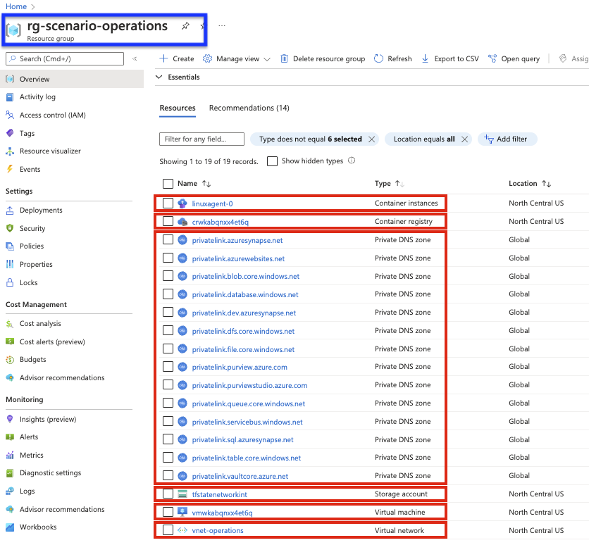
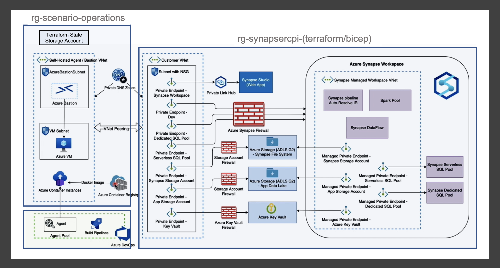

# Terraform Deployment Instructions of Azure Synapse Recipe

When deploying the terraform version of the Azure Synapse recipe, the following few choices are to be made:

- Weather to use the existing operational hub or not.
- Weather to save the terraform state file locally or on the Azure Storage.
- Weather to deploy the recipe manually or via Azure DevOps CI/CD pipelines.

Before getting into the deployment details, the concept of Operational Hub has been explained in the next section.

## Operational (Management) Hub

By default, the public access is disabled for the various Azure resources being deployed as part of this recipe such as Azure Storage, Azure Key Vault, Synapse Workspace etc. Because of that, the data plane calls for Synapse are also restricted. Additionally, this recipe has a post IaC deployment task which is to create and approve the managed private endpoints for Synapse which are done using REST API calls. So to have a complete end-to-end environment, the following components are required:

- A Storage account to store terraform state file
- A self-hosted agent for facilitating CI/CD deployment
- A Virtual Machine (VM) with network line of sight to the deployed resources
- Azure Bastion (optional) to securely connect to the Virtual Machine
- Centrally deployed Private DNS Zones (can be shared by different recipes)

All of these components (and other supporting resources) are together referred as "Operational (Management) Hub" in context of the recipes and allows the deployment of recipes in a hub-spoke architecture. The "Operational Hub" can be deployed once and be used by all the recipes.

### Deployment of Operational Hub

The Azure DevOps pipeline [management-operations](./../../../../.azuredevops/pipelines/management-operations.yml) can be used to deploy the central "Operational Hub". It deploys a new resource group, `rg-scenario-operations`, containing an Azure Virtual Network, Azure Container Registry, a number of Linux Azure Container Instances, along with several other supporting resources. The Azure Container Registry contains a repository with a single image, built via Dockerfile, that ensures the agents have the proper packages installed to run CD pipelines. The Linux container instances are built via this image and connected to an agent pool `network-integration-pool` in Azure DevOps, subsequently serving as the self-hosted agents for a recipe's CD pipeline.

Here is a snapshot of the main resources being deployed as part of "Operational Hub".

## Synapse Recipe Deployment in Operational Hub

If you decide to integrate the recipe with the existing Operational Hub, you would do so by setting the variable `**integrate_with_hub**` (Refer [variables.tf](./../terraform/variables.tf)) to `true`. This setting would result in the following actions:

- Instead of creating new Private DNS Zones, the existing DNS Zones in the hub resource group (default: "rg-scenario-operations") would be used while creating the required Private Endpoints.
- The recipe's VNet would be linked to the existing DNS Zones. With that, the "A record" DNS entries would be made to the existing Private DNS Zones while creating the private endpoint.
- The hub VNet and the recipe VNet would be paired. This is required so that the hub has the network line of sight to the recipe's resources.
- The Terraform state file would be saved in Azure blob storage account in the hub by default.

Here is a view of the extended architecture of Synapse recipe when integrated with Operational hub:

## Deployment Instructions

The following is an additional pre-requisite to use this recipe:

- [Terraform](https://www.terraform.io/downloads.html)

### Manual Deployment

1. The [terraform.tfvars.sample](./terraform.tfvars.sample) file contains the necessary variables to apply the terraform configuration. Rename the file to **terraform.tfvars** and update the file with appropriate values. Descriptions for each variable can be found in the [variables.tf](./variables.tf) file. By default, it assumes that the recipe is deployed as standalone i.e., it's not integrated with existing operational hub (`**integrate_with_hub**` set to `false`). If you have an existing operational hub, you can set this variable to `true` and provide details of corresponding variables.
1. Initialize terraform - `terraform init`
1. Optionally, verify what terraform will deploy - `terraform plan`
1. Deploy the configuration - `terraform apply`

### Deployment via CI/CD

There are two pipelines for deploying the terraform version of Synapse Recipe:

1. The CI Pipeline - [synapse-recipe-ci-terraform.yml](./../../../../.azuredevops/pipelines/synapse-recipe-ci-terraform.yml)

   This pipeline performs terraform linting, initializes terraform and runs "tf plan". For terraform backend, it uses the storage account details provided in [synapse-recipe-terraform.yml](./../../../../.azuredevops/pipelines/variables/synapse-recipe-terraform.yml).

2. The CD Pipeline - [synapse-recipe-cd-terraform.yml](./../../../../.azuredevops/pipelines/synapse-recipe-cd-terraform.yml)
   This pipeline deploys the recipe via "tf apply" command. The output of the terraform deployment is published and the names of few resources are retrieved and assigned to Azure Devops variables, to be used in subsequent job. The pipeline then run a shell script as a post deployment step to create and approve synapse managed private endpoints.

Both of these pipelines use the common variable file [synapse-recipe-terraform.yml](./../../../../.azuredevops/pipelines/variables/synapse-recipe-terraform.yml). In addition to the variables defined in this variable file, there are other variables as well required for the CI/CD pipelines. Here is a complete list of the variables and their description:

| Variable Name | Description | Where to Set? | Default Value |
| --- | --- | --- | --- |
| resourceGroupName | The name of the resource group where the recipe is deployed | Variable File | rg-synapsercpi-terraform |
| resourceBaseName | The base name to be appended to all provisioned resources | Variable File | synapsercpti |
| location | Specifies the supported Azure location (region) where the resources exist | Variable File | australiaeast |
| vnetAddressPrefix | The IP address prefix for the recipe's virtual network | Variable File | 10.10.0.0/16 |
| privateEndpointSubnetAddressPrefix | The IP address prefix for the virtual network subnet used for private endpoints | Variable File | 10.10.0.0/24 |
| bastionSubnetAddressPrefix | The IP address prefix for the virtual network subnet used for Azure Bastion integration | Variable File | 10.10.0.0/24 |
| integrateWithHub | Indicates if the recipe is to be integrated with centrally deployed hub or not | Variable File | true |
| operationsVnetName | The name of virtual network where the self hosted agent is deployed in the Hub  | Variable File | vnet-operations |
| operationsResourceGroupName | The name of the Azure resource group containing the Azure Private DNS Zones used for registering private endpoints | Variable File | rg-scenario-operations |
| operationsSubscriptionId | The subscription id of the Hub | Pipeline Variable | - |
| agentPoolName | The name of the Agent Pool for running the pipeline | Variable File | network-integration-pool |
| tfStateSubscriptionId | Subscription Id of storage account for saving terraform state | Pipeline Variable | - |
| tfStateResourceGroupName | Resource group of storage account for saving terraform state | Variable File | rg-scenario-operations |
| tfStateStorageAccountName | Storage account name for saving terraform state | Pipeline Variable | - |
| tfStateContainerName | Storage container name for saving terraform state | Variable File | tfstate |
| tags | Tag object for the resources created | Variable File | environment: "dev" |
| synSqlAdminUsername | Specifies The login name of the SQL administrator | Pipeline Variable | - |
| synSqlAdminPassword | The Password associated with the sql_administrator_login for the SQL administrator | Pipeline Variable | - |
| azureServiceConnection | The AzDo Service Connection used for recipe deployment | Picked at Runtime | - |
| azdoAppVnetName | The name of the recipe's virtual network | Derived in pipeline | vnet-synapsercpti |
| azdoSynapseWorkspaceName | The name of deployed Azure Synapse workspace in the recipe | Derived in pipeline | synw-synapsercpti |
| azdoSynStorageAccountName | The name of deployed Synapse Storage Account in the recipe | Derived in pipeline | st1synapsercpti |
| azdoAppStorageAccountName | The name of deployed Application Storage Account in the recipe | Derived in pipeline | st2synapsercpti |
| azdoKeyVaultName | The name of the deployed Key Vault in the recipe | Derived in pipeline | kv-synapsercpti |
