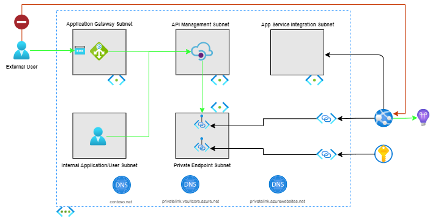
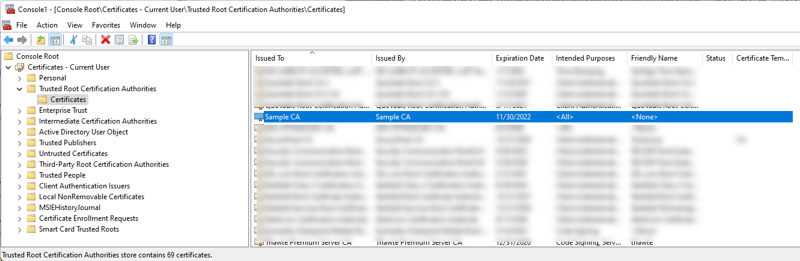

# Azure Web App with Internal API Management and Application Gateway

## Scenario

This recipe addresses a scenario where there is a requirement to restrict HTTP/S access to an Azure Web App to a specific virtual network, while providing advanced security and networking functionality like firewalls, ssl offloading, etc. In this scenario, only clients which are connected to the specified virtual network or are able to bypass the firewall and networking rules can access the Azure Web App.

The Azure Web App is configured with an (inbound) [Private Endpoint](https://docs.microsoft.com/azure/app-service/networking/private-endpoint). The Web App's Private Endpoint is assigned an IP address from the specified Private Endpoint subnet.

> When a Private Endpoint is enabled on the Azure Web App, public Internet access is automatically disabled. This applies to the primary site (e.g., <https://contoso.azurewebsites.net>) and the Kudu/SCM site (e.g., <https://contoso.scm.azurewebsites.net>).

API Management and Application Gateway services allow for a custom security profile for the Azure Web App when used in tandem. An API Management instance in internal mode is placed in front of the Azure Web App and controls all traffic that is routed to the API from within the network. API callers from within the virtual network are able to access the Web App via the API Management endpoints. An Application Gateway handles ingress into the network and routes requests from outside the virtual network to the API Management instance. It has an associated Web Application Firewall (WAF) that can be used to restrict access to the API from outside the network.

### Problem Summary

There are multiple challenges to configuring an Azure Web App to be accessible only via a private virtual network or from a set of trusted partners:

- Configuration of the application's private endpoint.
- Connecting to dependent application resources via a private endpoint.
- Deploying application code to the web application.
- Management of certificates for API Management custom domains.
- Configuration of the connection between Application Gateway and API Management.

This recipe attempts to make such configuration easier by providing both Terraform and Bicep assets to serve as a starting point to understand how to configure an (inbound) Private Endpoint for the Azure Web App with additional layers of security and functionality provided by API Management and Application Gateway.

### Architecture



### Recommendations

The following sections provide recommendations on when this recipe should, and should not, be used.

#### Recommended

This recipe is recommended if the following conditions are true:

- The Azure Web App's HTTP/S endpoint is accessible only from within the designated virtual network, or from a set of trusted callers outside the network.
- Private (virtual network) connectivity to the Azure Key Vault used for persisting application secrets.
- Ability to use Azure Private DNS Zones.
- Ability to use a virtual network connected agent (i.e., self-hosted agent or runner) to deploy application code to the Azure Web App.
- Requirement to apply custom API policies like rate limiting, caching, etc.
- Customizable firewall rules are required that dictate which entities can make requests to resources within the network from the public internet.

#### Not Recommended

This recipe is **not** recommended if the following conditions are true:

- Azure Web App's HTTP/S endpoint is accessible from the public Internet.

## Getting Started

The following sections provide details on pre-requisites to use the recipe, along with deployment instructions.

### Pre-requisites

The following pre-requisites should be in place in order to successfully use this recipe:

- [Azure CLI](https://docs.microsoft.com/cli/azure/install-azure-cli)
- [.NET Core 3.1](https://docs.microsoft.com/dotnet/core/install/)

### Deployment

To deploy this recipe, perform the infrastructure deployment steps using _either_ Terraform or Bicep before deploying the Azure Web App's code.

### Remote Access

The recipe does not provision a Virutal Machine (VM) or Azure Bastion to provide remote access within the virtual network.  If a VM or Bastion is needed, modify the virtual network topology to add the necessary subnets (for example, add subnets "snet-vm" for the VM and "AzureBastionSubnet" for Azure Bastion).

#### Virtual Network

The recipe provides for the ability to deploy Azure resources to a hub/spoke virtual network model.  In the hub/spoke model, the recipe assumes Azure Private DNS zones reside in another resource group.  The recipe includes parameters/variables to control how Azure Private DNS Zones are used - either use existing Private DNS Zones, or create new Private DNS Zones.

#### Create Certificates for API Management Custom Domains

API Management is able to expose endpoints using a custom domain rather than the default `azure-api.net` subdomain that is assigned to the service. In this recipe, custom domains are used in order to allow the user to expose an API using the same domain name both _inside_ and _outside_ the virtual network. Inside the virtual network, the custom domains map directly to the API Management private IP address. The domains are mapped to the Application Gateway public IP address for calls originating from outside the virtual network. The recipe assumes that the user possesses the server certificates for the Gateway, Portal, and Management endpoints on for the API Management instance, and the root certificate used to sign those requests. The [create-certificates.sh](./deploy/create-certificates.sh) script provides openssl commands to create and self-sign the required certificates. Run the script, providing the root host for the certificate, for example:

``` shell
./create-certificates.sh *.contoso.net
```

It is important to prefix your domain with *, so the same generated domain cert may be used for all the different sub domains.
The script creates a `.certs` folder that contains each of the `.pfx` certificates for the API Management custom domains and the `.crt` file for the root. The `.txt` files contain base64 encoded versions of these certificates and are used in the parameters that are passed to the Terraform or Bicep versions of the recipe.

#### Deploying Infrastructure Using Terraform

The following is an additional pre-requisite to use this recipe:

- [Terraform](https://www.terraform.io/downloads.html)

> Be sure the domain used in the variables file matches the hostname of the certificates.  For example, if the certificates were created using `*.contoso.net`, the variables file should use `contoso.net` for the domains.

1. The [terraform.tfvars.sample](./deploy/terraform/terraform.tfvars.sample) file contains the necessary variables to apply the terraform configuration. Rename the file to **terraform.tfvars** and update the file with appropriate values. Descriptions for each variable can be found in the [variables.tf](./deploy/terraform/variables.tf) file.
1. Initialize terraform.

   ```shell
   terraform init
   ```

1. Optionally, verify what terraform will deploy

   ```shell
   terraform plan \
    -var "gateway_custom_domain_certificate=$(cat ../.certs/domain.pfx.txt)" \
    -var "portal_custom_domain_certificate=$(cat ../.certs/domain.pfx.txt)" \
    -var "management_custom_domain_certificate=$(cat ../.certs/domain.pfx.txt)" \
    -var "trusted_root_certificate=$(cat ../.certs/rootCA.crt.txt)"
   ```

1. Deploy the configuration.

   ```shell
   terraform apply \
    -var "gateway_custom_domain_certificate=$(cat ../.certs/domain.pfx.txt)" \
    -var "portal_custom_domain_certificate=$(cat ../.certs/domain.pfx.txt)" \
    -var "management_custom_domain_certificate=$(cat ../.certs/domain.pfx.txt)" \
    -var "trusted_root_certificate=$(cat ../.certs/rootCA.crt.txt)"
   ```

> The snippets above reads the certificate contents from the previously generated files. Alternatively, copy the certificate content into the appropriate fields of the parameters file, as shown in the below video.


> **_NOTE:_** The project contains a [deploy.sh](./deploy/terraform/deploy.sh) script file that uses similar steps to those above, as well as virtual network peering support (if needed).

#### Deploying Infrastructure Using Bicep

The following is an additional pre-requisite to use this recipe:

- [Bicep](https://docs.microsoft.com/en-us/azure/azure-resource-manager/bicep/install)

> Be sure the domain used in the parameters file matches the hostname of the certificates.  For example, if the certificates were created using `*.contoso.net`, the parameters file should use `contoso.net` for the domains.

1. Create a new Azure resource group to deploy the Bicep template to, passing in a location and name.

    ```shell
    az group create --location <LOCATION> --name <RESOURCE_GROUP_NAME>
    ```

1. The [azuredeploy.parameters.sample.json](./deploy/bicep/azuredeploy.parameters.sample.json) file contains the necessary variables to deploy the Bicep project. Rename the file to **azuredeploy.parameters.json** and update the file with appropriate values. Descriptions for each parameter can be found in the [main.bicep](./deploy/bicep/main.bicep) file.
   1. Set the `newOrExistingDnsZones` parameter to "new" (or don't set, as the default is "new") if creating a new Azure Private DNS Zone.
   1. Set the `dnsZoneResourceGroupName` parameter to the name of your resource group (or don't set, as the default is the name of the resource group) if creating a new Azure Private DNS Zone.
1. Optionally, verify what Bicep will deploy, passing in the name of the resource group created earlier and the necessary parameters for the Bicep template.

    ```shell
    az deployment group what-if --resource-group <RESOURCE_GROUP_NAME> \
    --template-file main.bicep \
    --parameters azuredeploy.parameters.json \
      applicationGatewayTrustedRootBase64EncodedPfxCertificate=$(cat ../.certs/rootCA.crt.txt) \
      apiManagementPortalCustomHostnameBase64EncodedPfxCertificate=$(cat ../.certs/domain.pfx.txt) \
      apiManagementProxyCustomHostnameBase64EncodedPfxCertificate=$(cat ../.certs/domain.pfx.txt) \
      apiManagementManagementCustomHostnameBase64EncodedPfxCertificate=$(cat ../.certs/domain.pfx.txt) \
    --verbose
    ```

1. Deploy the template, passing in the name of the resource group created earlier and the necessary parameters for the Bicep template.

    ```shell
    az deployment group create \
    --resource-group <RESOURCE_GROUP_NAME> \
    --template-file main.bicep \
    --parameters azuredeploy.parameters.json \
      applicationGatewayTrustedRootBase64EncodedPfxCertificate=$(cat ../.certs/rootCA.crt.txt) \
      apiManagementPortalCustomHostnameBase64EncodedPfxCertificate=$(cat ../.certs/domain.pfx.txt) \
      apiManagementProxyCustomHostnameBase64EncodedPfxCertificate=$(cat ../.certs/domain.pfx.txt) \
      apiManagementManagementCustomHostnameBase64EncodedPfxCertificate=$(cat ../.certs/domain.pfx.txt)
    ```

The snippet above reads the certificate contents from the previously generated files. Alternatively, copy the certificate content into the appropriate fields of the parameters file, as shown in the below video.

> **_NOTE:_** The project contains a [deploy.sh](./deploy/bicep/deploy.sh) script file that uses similar steps to those above, as well as virtual network peering support (if needed).


#### Deploying Web Application Code

Using Private Endpoints to secure Azure Web Apps not only ensures that the web app is publicly inaccessible, but also blocks requests to Azure Web App's SCM endpoint, used for deployment of application code. As a result, publishing code from a local machine via the SCM endpoint is not possible as the endpoint is restricted for use from within the virtual network. The following approaches can be taken in order to deploy code to the application:

- Use GitHub to push code to a new repository, then connect to the VM jumpbox provisioned by Terraform or Bicep using Bastion, clone the project and deploy using `az webapp deploy`. The VM does not have any of pre-requisite dev tools installed automatically, so installing the necessary packages (Azure CLI, .NET Core, etc.) on the machine is required before publishing.
- Before using the recipe, deploy a virtual network with agents that contain the project code, then utilize those (self-hosted) agents in a pipeline that allows for automated deployment of code to the Azure Web App.
- Connect the local machine to the virtual network using Point-to-Site, then publish normally from the local machine using `az webapp deploy` ([Microsoft Docs](https://docs.microsoft.com/azure/vpn-gateway/point-to-site-about)).
- Deploy using the "Run from package" approach, using an Azure Storage blob and the web application's managed identity, as noted [here](https://docs.microsoft.com/azure/app-service/deploy-run-package#fetch-a-package-from-azure-blob-storage-using-a-managed-identity). The [deploy-code.sh](./deploy/deploy-code.sh) script provides an example on how this can be accomplished. Run the script, providing the necessary arguments for the existing Azure Web App and the Azure Storage account that will be created in the process.

   ```shell
     ./deploy-code.sh <SUBSCRIPTION_ID> <RESOURCE_GROUP_NAME> <WEB_APP_NAME> <LOCATION> <STORAGE_ACCOUNT_NAME_TO_CREATE>
   ```

_Note: The script assumes the `zip` package is installed on the local machine._


### Testing Solution

To verify the solution is working as intended, the web app contains the simple web API deployed in the previous section. The API is the same Weather Forecast API generated as part of the default ASP.NET Core Web API template. The API contains a single GET method to retrieve a list of weather forecast data points.

From within the virtual network, the web API should be called via API Management using the custom domain added for the service's gateway endpoint. `https://api.{CUSTOM_DOMAIN}/weatherforecast` should return an HTTP 200 (OK) to requests that originate from inside the virtual network, along with a JSON structure of weather forecast data points.

1. Navigate to the [Azure Portal](https://portal.azure.com) and find the Virtual Machine provisioned by Bicep or Terraform earlier.
1. Open the **Connect** blade and select **Bastion**
1. Click the **Use Bastion** button and input the admin username and password that were created in the variables file during Bicep or Terraform deployment.
1. Once the connection to the VM is established, open a Powershell window and make a curl request to the url - `curl https://api.{CUSTOM_DOMAIN}/weatherforecast` and observe the 200 response.

Requests from an address space outside the virtual network must be routed through Application Gateway. A computer's hosts file dictates how the machine will resolve DNS names and can be used to map each of the custom domains to the IP address of the Application Gateway, allowing the machine to make requests to the same `/weatherforecast` endpoint from outside the virtual network.

1. Navigate to the [Azure Portal](https://portal.azure.com) and find the Application Gateway provisioned by Bicep or Terraform earlier.
1. Copy the Application Gateway's public IP address.
1. Open the local machine's hosts file (C:\Windows\System32\drivers\etc\hosts) in administrator mode.
1. Add 3 records for each of the custom domains, each mapping to the same IP address of the Application Gateway

   ```text
   {APPLICATION_GATEWAY_IP} api.{CUSTOM_DOMAIN}
   {APPLICATION_GATEWAY_IP} portal.{CUSTOM_DOMAIN}
   {APPLICATION_GATEWAY_IP} management.{CUSTOM_DOMAIN}
   ```

1. Add the generated root certificate (rootCA.crt) to the "Trusted Root Certification Authorities" certificate store.  This will "trust" the generated root certificate for local testing.

1. Make a request to the same `https://api.{CUSTOM_DOMAIN}/weatherforecast` endpoint from your local machine and observe the same 200 response.


## Change Log

- 2022-10-10 - Support AzureRM 3.25.0 and Terraform 1.3.2.
- 2022-07-22
  - Default Azure Web App plans to Premium v3 SKU to ensure deployment to hardware capable of supporting virtual network integartion on a Basic SKU. Change app plan SKU to Basic (B1) in the Azure DevOps pipeline.
- 2022-04-14
  - Terraform - remove Virtual Machine and Azure Bastion, and support hub/spok virtual network with Azure Private DNS Zones (similar to prior changes for Azure Bicep version).
- 2022-04-01
  - Support a hub/spoke virtual network with Azure Private DNS Zones in hub (different resource group).
  - Azure Bicep - remove Virtual Machine and Azure Bastion
- 2021-10-13
  - Initial check-in of recipe.
- 2021-11-30
  - Add root CA certificate to the "Trusted Root Certificate Authorities" certificate store.

## Next Steps

### Create Web Application Firewall (WAF) Rules on Azure Application Gateway

Azure Application Gateway is integrated with Azure Web Application Firewall (WAF) out of the box and can be used to protect the backend web app from common exploits and attacks. WAF uses policies to secure the application against web vulnerabilities and attacks without modification to back-end code.

Additional information can be found in the following resources:

- [What is Azure Web Application Firewall on Azure Application Gateway?](https://docs.microsoft.com/azure/web-application-firewall/ag/ag-overview)

### Limit API access to a specific set of trusted / well-known IP (IPv4) addresses

By default, a web application hosted with the multi-tenant Azure App Service is fully Internet accessible (i.e., anyone or anything with Internet access can access the web application's endpoint, not accounting for user authentication or authorization).

A customer may have a requirement to limit API access to a specific set of trusted or well-known IP addresses. For example, the customer may want to limit API access to a known set of IP addresses associated with specific business partners. To limit access by IP address, multiple options exists.

#### Options

- Enable IP restrictions using a Network Security Group (NSG) associated with the subnet containing the Application Gateway instance. Please refer to [official documentation](https://docs.microsoft.com/azure/application-gateway/configuration-infrastructure#allow-access-to-a-few-source-ips) for more information. If using this approach, and the provide recipe, you will need to replace or modify the current "https-in" rule on the "nsg-apimappgwrcp-{env}-agw" NSG (which allows HTTPS traffic from Any source). You can provide a new NSG rule with specific Protocol (HTTPS, HTTP) access for a specific IP address or IP address range. The new rule will need to have a higher (lower number) than the default Inbound rules.
- Enable an API Management [policy](https://docs.microsoft.com/azure/api-management/api-management-access-restriction-policies#RestrictCallerIPs)
- Configure [Web App access restrictions](https://docs.microsoft.com/en-us/azure/app-service/app-service-ip-restrictions). However, if using the included recipe, access restrictions are not applicable due to the use of private endpoints (which limit access to only clients within the virtual network.

Additional information can be found in the following resources:

- [Firewall and Application Gateway for virtual networks](https://docs.microsoft.com/azure/architecture/example-scenario/gateway/firewall-application-gateway)
- [Security in Azure App Service](https://docs.microsoft.com/azure/app-service/overview-security)
- [Azure security baseline for App Service](https://docs.microsoft.com/security/benchmark/azure/baselines/app-service-security-baseline?toc=/azure/app-service/toc.json)
- [Azure security baseline for Application Gateway](https://docs.microsoft.com/security/benchmark/azure/baselines/application-gateway-security-baseline)
- [Azure Firewall vs. Network Security Group (NSG)](https://darawtechie.com/2019/09/05/azure-firewall-vs-network-security-group-nsg/) _Note: This is a personal blog._

#### Recommendation

The general recommendation for IP restrictions is to configure an NSG with the rules (ACLs) that restrict access to the required IP address(es), port(s), and protocol(s). Doing so will enable the rules to be applied at the software networking layer, which should be less resource (CPU and memory) intensive than custom Web Application Firewall rules. Additionally, for this recipe, both API Management and the Web App are accessible only via the (internal) virtual network.

### Prevent Outbound Internet Access

Network Security Groups can be used to block outbound internet access for applications inside the virtual network, as a security precaution. A general recommendation is to block all outbound internet access, except for those services or IP addresses which are required by the web application.

Additional information can be found in the following resources:

- [Network security groups](https://docs.microsoft.com/en-us/azure/virtual-network/network-security-groups-overview)

### Web Application Firewall on Application Gateway

The Web Application Firewal (WAF) on Application Gateway is configured in Detection mode.  Incoming requests are **not** blocked, and are logged for inspection. Per Microsoft [documentation](https://docs.microsoft.com/azure/web-application-firewall/ag/ag-overview#waf-modes), it is recommended to deploy the WAF in Detection mode and evaluate the logs to ensure unexpected traffic is not blocked. Once you're confident in the rule configuration, change to Prevention mode.
