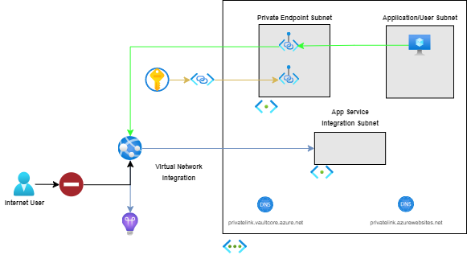
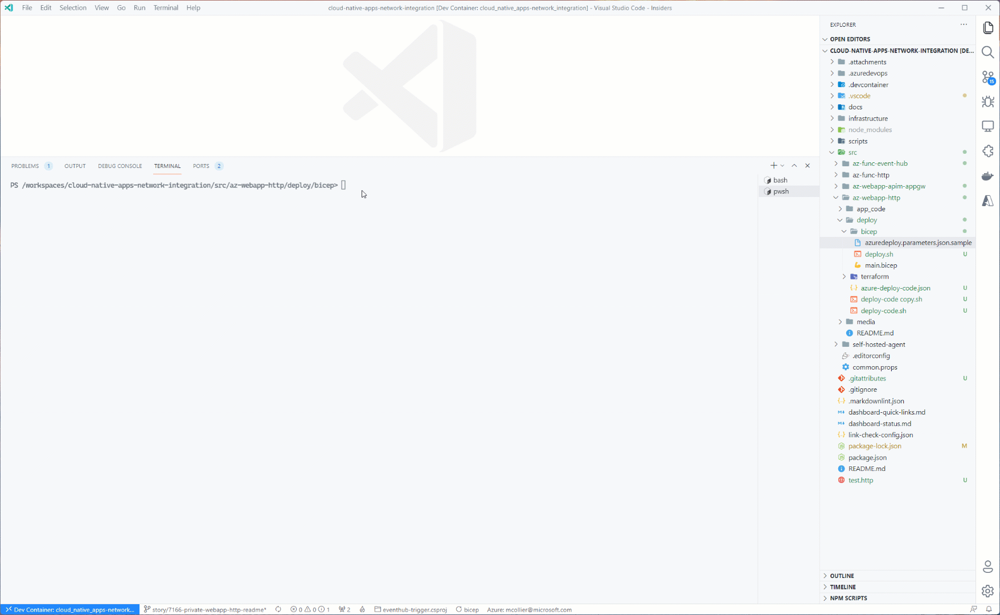

# Azure Web App with Inbound Private Endpoint

## Scenario

This recipe addresses a scenario where there is a requirement to restrict HTTP/S access to an Azure Web App to a specific virtual network. In this scenario, only clients which are connected to the specified virtual network are able to access the Azure Web App.

The Azure Web App is configured with an (inbound) [Private Endpoint](https://docs.microsoft.com/azure/app-service/networking/private-endpoint). The Web App's Private Endpoint is assigned an IP address from the specified Private Endpoint subnet.

> When a Private Endpoint is enabled on the Azure Web App, public Internet access is automatically disabled. This applies to the primary site (e.g., <https://contoso.azurewebsites.net>) and the Kudu/SCM site (e.g., <https://contoso.scm.azurewebsites.net>).

Additionally, the web app uses [regional virtual network integration](https://docs.microsoft.com/azure/app-service/web-sites-integrate-with-vnet#regional-vnet-integration) to communicate with other Azure services connected to, or integrated with, the same virtual network. Azure Key Vault has been configured with a private endpoint, and the web app is able to retrieve secrets from Key Vault (via the private endpoint).

This recipe is conceptually similiar to the Azure Function with Private HTTP Endpoint recipe.

### Problem Summary

There are multiple challenges to configuring an Azure Web App to be accessible only via a private virtual network using Private Endpoints.

- Configuration of the application's private endpoint.
- Connecting to dependent application resources via a private endpoint.
- Deploying application code to the web application.

This recipe attempts to make such configuration easier by providing both Terraform and Bicep assets to serve as a starting point to understand how to configure an (inbound) Private Endpoint for the Azure Web App.

### Architecture



### Recommendations

The following sections provide recommendations on when this recipe should, and should not, be used.

#### Recommended

This recipe is recommended if the following conditions are true:

- The Azure Web App's HTTP/S endpoint is accessible only from within the designated virtual network.
- Private (virtual network) connectivity to the Azure Key Vault used for persisting application secrets.
- Ability to use Azure Private DNS Zones.
- Ability to use a virtual network connected agent (i.e., self-hosted agent or runner) to deploy application code to the Azure Web App.

#### Not Recommended

This recipe is **not** recommended if the following conditions are true:

- Azure Web App's HTTP/S endpoint is accessible from the public Internet.

## Getting Started

The following sections provide details on pre-requisites to use the recipe, along with deployment instructions.

### Pre-requisites

The following pre-requisites should be in place in order to successfully use this recipe:

- [Azure CLI](https://docs.microsoft.com/cli/azure/install-azure-cli)
- [.NET Core 3.1](https://docs.microsoft.com/dotnet/core/install/)
- [Terraform](https://www.terraform.io/downloads.html) (Only if using Terraform)
- [Bicep](https://docs.microsoft.com/azure/azure-resource-manager/bicep/install) (Only if using Azure Bicep)
- [Azure PowerShell](https://docs.microsoft.com/powershell/azure/install-az-ps) (Only if using Azure PowerShell to deploy via Azure Bicep)

### Deployment

To deploy this recipe, perform the infrastructure deployment steps using _either_ Terraform or Bicep before deploying the Azure Web App's code.

### Remote Access

The recipe does not provision a Virutal Machine (VM) or Azure Bastion to provide remote access within the virtual network.  If a VM or Bastion is needed, modify the virtual network topology to add the necessary subnets (for example, add subnets "snet-vm" for the VM and "AzureBastionSubnet" for Azure Bastion).

#### Virtual Network

The recipe provides for the ability to deploy Azure resources to a hub/spoke virtual network model.  In the hub/spoke model, the recipe assumes Azure Private DNS zones reside in another resource group.  The recipe includes parameters/variables to control how Azure Private DNS Zones are used - either use existing Private DNS Zones, or create new Private DNS Zones.

#### Deploying Infrastructure Using Terraform

1. The [terraform.tfvars.sample](./deploy/terraform/terraform.tfvars.sample) file contains the necessary variables to apply the terraform configuration. Rename the file to **terraform.tfvars** and update the file with appropriate values. Descriptions for each variable can be found in the [variables.tf](./deploy/terraform/variables.tf) file.
1. Initialize terraform - `terraform init`
1. Optionally, verify what terraform will deploy - `terraform plan`
1. Deploy the configuration - `terraform apply`

   

> **_NOTE:_** The project contains a [deploy.sh](./deploy/terraform/deploy.sh) script file that uses similar steps to those above, as well as virtual network peering support (if needed).

#### Deploying Infrastructure Using Bicep

<!-- TODO: Update to use Azure CLI. -->

> Azure PowerShell is shown below due to a [likely bug in Azure CLI 2.27.0 and 2.27.1](https://github.com/Azure/azure-cli/issues/19308) which prevents execution of the provided Azure Bicep modules using the Azure CLI.

1. Create a new Azure resource group to deploy the Bicep template, passing in a location and name:

   ```PowerShell
   New-AzResourceGroup -Location <LOCATION> -Name <RESOURCE_GROUP_NAME>
   ```

1. The [azuredeploy.parameters.sample.json](./deploy/bicep/azuredeploy.parameters.sample.json) file contains the necessary variables to deploy the Bicep project. Rename the file to **azuredeploy.parameters.json** and update the file with appropriate values. Descriptions for each parameter can be found in the [main.bicep](./deploy/bicep/main.bicep) file.
   1. Set the `newOrExistingDnsZones` parameter to "new" (or don't set, as the default is "new") if creating a new Azure Private DNS Zone.
   1. Set the `dnsZoneResourceGroupName` parameter to the name of your resource group (or don't set, as the default is the name of the resource group) if creating a new Azure Private DNS Zone.  
1. Optionally, verify what Bicep will deploy, passing in the name of the resource group created earlier and the necessary parameters for the Bicep template.

   ```PowerShell
   New-AzResourceGroupDeployment `
     -ResourceGroupName <RESOURCE_GROUP_NAME> `
     -TemplateFile ./main.bicep `
     -TemplateParameterFile ./azuredeploy.parameters.json `
     -WhatIf
   ```

1. Deploy the template, passing in the name of the resource group created earlier and the necessary parameters for the Bicep template.

   ```PowerShell
   New-AzResourceGroupDeployment `
     -ResourceGroupName <RESOURCE_GROUP_NAME> `
     -TemplateFile ./main.bicep `
     -TemplateParameterFile ./azuredeploy.parameters.json
   ```

> **_NOTE:_** The project contains a [deploy.sh](./deploy/bicep/deploy.sh) script file that uses similar steps to those above, as well as virtual network peering support (if needed).

   

#### Deploying Web Application Code

Using Private Endpoints to secure Azure Web Apps not only ensures that the web app is publicly inaccessible, but also blocks requests to Azure Web App's SCM endpoint, used for deployment of application code. As a result, publishing code from a local machine via the SCM endpoint is not possible as the endpoint is restricted for use from within the virtual network. The following approaches can be taken in order to deploy code to the application:

- Use GitHub to push code to a new repository, then connect to the VM jumpbox provisioned by Terraform or Bicep using Bastion, clone the project and deploy using `az webapp deploy`. The VM does not have any of pre-requisite dev tools installed automatically, so installing the necessary packages (Azure CLI, .NET Core, etc.) on the machine is required before publishing.
- Before using the recipe, deploy a virtual network with agents that contain the project code, then utilize those (self-hosted) agents in a pipeline that allows for automated deployment of code to the Azure Web App.
- Connect the local machine to the virtual network using Point-to-Site, then publish normally from the local machine using `az webapp deploy` ([Microsoft Docs](https://docs.microsoft.com/azure/vpn-gateway/point-to-site-about)).
- Deploy using the "Run from package" approach, using an Azure Storage blob and the web application's managed identity, as noted [here](https://docs.microsoft.com/azure/app-service/deploy-run-package#fetch-a-package-from-azure-blob-storage-using-a-managed-identity). The script below provides an example on how this can be accomplished.

  ```bash
  #!/bin/bash

  SUBSCRIPTION_ID=[AZURE-SUBSCRIPTION-ID]
  STORAGE_ACCOUNT_NAME=[NEW-STORAGE-ACCOUNT-NAME]
  RESOURCE_GROUP_NAME=[RESOURCE-GROUP-NAME]
  WEB_APP_NAME=[AZURE-WEB-APP-NAME]
  LOCATION=northcentralus

  # Create storage account
  az storage account create --location $LOCATION --name $STORAGE_ACCOUNT_NAME --resource-group $RESOURCE_GROUP_NAME --allow-blob-public-access false --https-only true --kind Storage --sku Standard_GRS

  # Create a container
  az storage container create --name app-code --account-name $STORAGE_ACCOUNT_NAME

  # Assign web app identity to storage account
  WEB_APP_ID=$(az webapp identity show --resource-group $RESOURCE_GROUP_NAME --name $WEB_APP_NAME --query principalId -o tsv)

  az role assignment create \
      --role "Storage Blob Data Reader" \
      --assignee "$WEB_APP_ID" \
      --scope /subscriptions/$SUBSCRIPTION_ID/resourceGroups/$RESOURCE_GROUP_NAME/providers/Microsoft.Storage/storageAccounts/$STORAGE_ACCOUNT_NAME

  # Build code
  cd ../common/app_code/WeatherForecastAPI/ || exit

  dotnet publish --configuration Release

  # zip code
  cd ./bin/Release/netcoreapp3.1/publish || exit
  zip -r code.zip .

  # Copy the zipped file to the WeatherForecastAPI folder.
  cp code.zip ../../../../code.zip

  # Change directory back to the WeatherForecastAPI folder.
  cd ../../../.. || exit

  # Upload zipped code to storage account
  az storage blob upload --account-name $STORAGE_ACCOUNT_NAME --container app-code --file ./code.zip --name code.zip --auth-mode key

  # Get URI for uploaded blob -
  BLOB_PACKAGE_URI="https://$STORAGE_ACCOUNT_NAME.blob.core.windows.net/app-code/code.zip"

  cd ../../deploy || exit

  az webapp config appsettings set --resource-group $RESOURCE_GROUP_NAME --name $WEB_APP_NAME --settings WEBSITE_RUN_FROM_PACKAGE=$BLOB_PACKAGE_URI

  # May only need to restart if a new package was uploaded.
  az webapp restart --resource-group $RESOURCE_GROUP_NAME --name $WEB_APP_NAME
  ```

### Testing Solution

To verify the solution is working as intended, the web app contains a simple web API. The API is the same Weather Forecast API generated as part of the default ASP.NET Core Web API template. The API contains a single GET method to retrieve a list of weather forecast data points.

The endpoint should return an HTTP 200 (OK) to requests that originate from _inside_ the virtual network, along with a JSON strucure of weather forecast data points.

```json
[
  {
    "date": "2021-09-08T20:41:00.6937892+00:00",
    "temperatureC": 20,
    "temperatureF": 67,
    "summary": "Cool"
  },
  {
    "date": "2021-09-09T20:41:00.6938342+00:00",
    "temperatureC": -2,
    "temperatureF": 29,
    "summary": "Chilly"
  },
  {
    "date": "2021-09-10T20:41:00.6938612+00:00",
    "temperatureC": -18,
    "temperatureF": 0,
    "summary": "Sweltering"
  },
  {
    "date": "2021-09-11T20:41:00.6939293+00:00",
    "temperatureC": 26,
    "temperatureF": 78,
    "summary": "Warm"
  },
  {
    "date": "2021-09-12T20:41:00.6939582+00:00",
    "temperatureC": 36,
    "temperatureF": 96,
    "summary": "Hot"
  }
]
```

Requests from an address space outside the virtual network are not permitted.


## Change Log

- 2022-10-10 - Support AzureRM 3.25.0 and Terraform 1.3.2.
- 2022-07-22
  - Default Azure Web App plans to Premium v3 SKU to ensure deployment to hardware capable of supporting virtual network integartion on a Basic SKU. Change app plan SKU to Basic (B1) in the Azure DevOps pipeline.
- 2022-04-14
  - Terraform - remove Virtual Machine and Azure Bastion, and support hub/spok virtual network with Azure Private DNS Zones (similar to prior changes for Azure Bicep version).
- 2022-04-01
  - Support a hub/spoke virtual network with Azure Private DNS Zones in hub (different resource group).
  - Azure Bicep - remove Virtual Machine and Azure Bastion
- 2021-09-03
  - Initial check-in of recipe.

## Next Steps

Below are a few ideas on how to extend the functionality of the web application:

- Retrieve data from or persist data to a database (optionally connected to a virtual network).
- Expose the web application's web API via Azure API Management.
- Place a web application firewall, such as the one included with Azure Application Gateway, in front of the web application.
